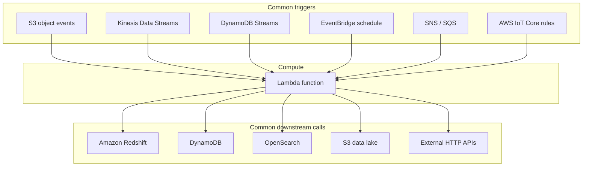
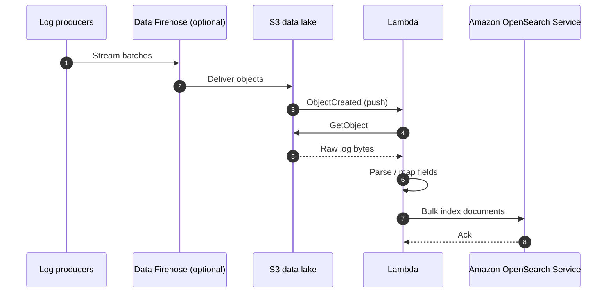
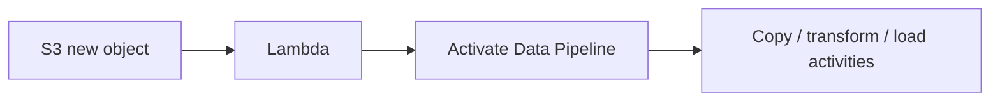
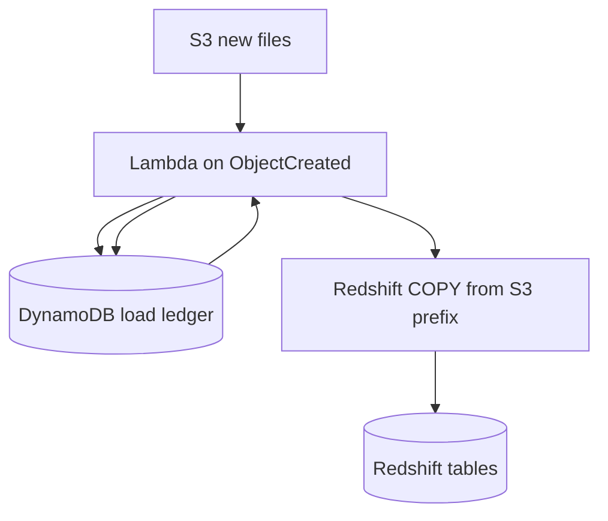
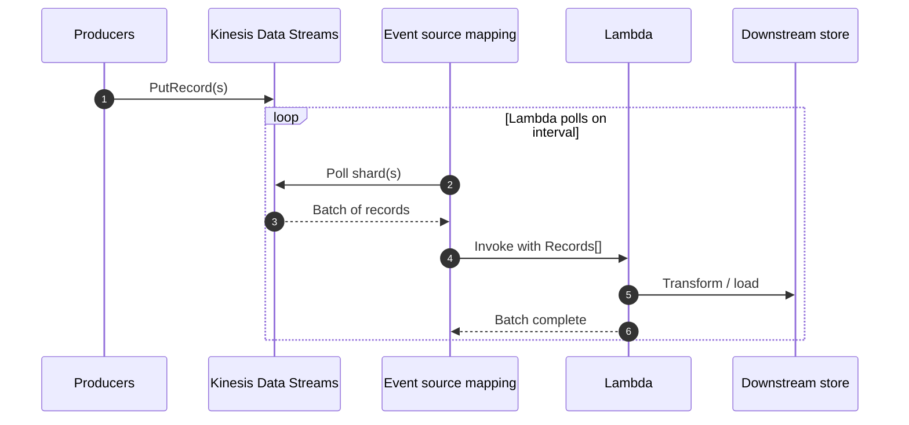
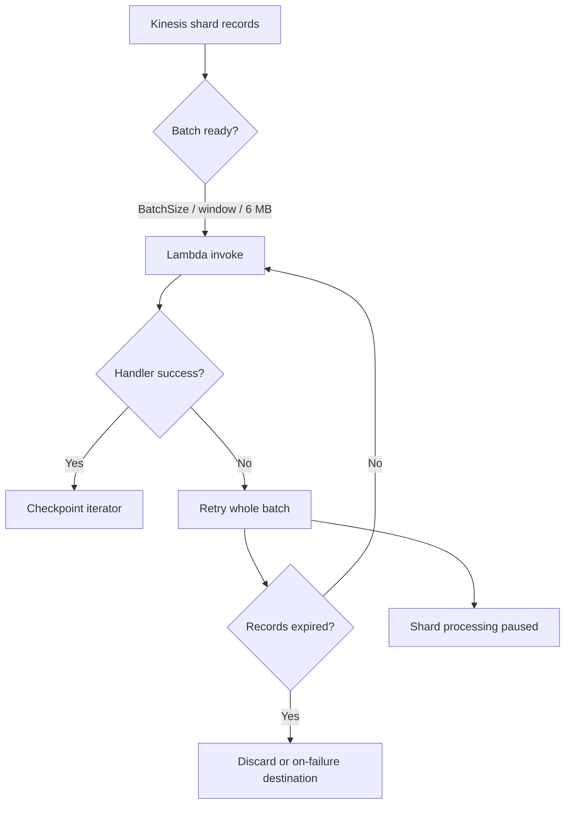
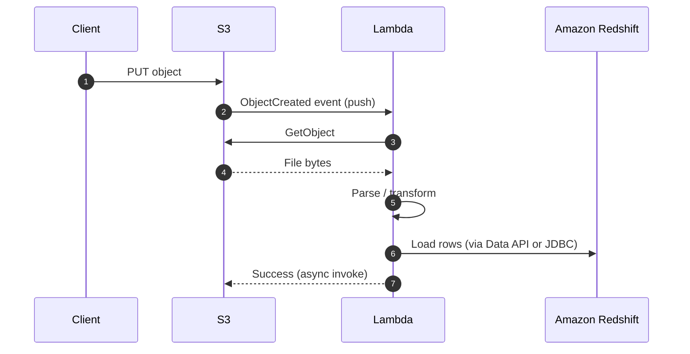
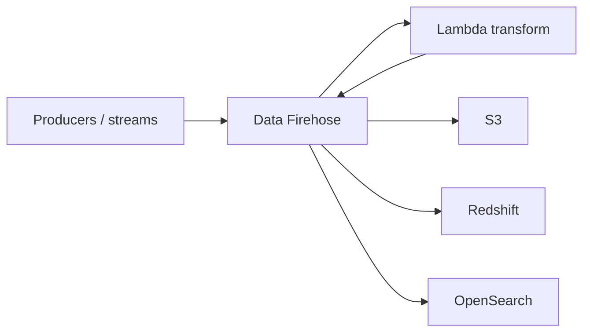

# Lambda Integration

## :material-school: What you'll learn

!!! abstract "Learning objectives"
    You will connect :simple-amazonaws: <a href="https://docs.aws.amazon.com/lambda/latest/dg/welcome.html">AWS Lambda</a> to services that **trigger** your functions and to analytics stores you **call downstream**—including S3-to-<a href="https://docs.aws.amazon.com/opensearch-service/latest/developerguide/what-is.html">OpenSearch</a> glue, on-demand <a href="https://docs.aws.amazon.com/datapipeline/latest/DeveloperGuide/what-is-datapipeline.html">AWS Data Pipeline</a> runs, <a href="https://docs.aws.amazon.com/redshift/latest/dg/r_COPY.html">COPY</a>-based <a href="https://docs.aws.amazon.com/redshift/latest/mgmt/welcome.html">Redshift</a> loads with DynamoDB checkpoints, and the **Kinesis batching pitfalls** (timeouts, 6&nbsp;MB payloads, shard stalls) that show up on exams.

## :material-book-open-variant: Key definitions

| Term | Definition |
|---|---|
| <a href="https://docs.aws.amazon.com/lambda/latest/dg/invocation-eventsourcemapping.html">**Event source mapping**</a> | A Lambda-managed configuration that **polls** a stream or queue (Kinesis, DynamoDB Streams, SQS, …) and invokes your function with **batches** of records. |
| **Direct trigger (push)** | A service **pushes** an event to Lambda when something happens—common for S3 object events, SNS messages, and API Gateway requests. |
| <a href="https://docs.aws.amazon.com/AmazonS3/latest/userguide/EventNotifications.html">**S3 event notification**</a> | Configuration on a bucket that sends events (for example `s3:ObjectCreated:*`) to Lambda when objects are created, removed, or modified. |
| <a href="https://docs.aws.amazon.com/amazondynamodb/latest/developerguide/Streams.html">**DynamoDB Streams**</a> | A time-ordered log of item-level changes in a table; paired with Lambda for **real-time, event-driven** processing as data lands. |
| **Glue / integration function** | Short-lived Lambda code that reacts to an event, **transforms** payloads, and calls the next AWS API (or an external system). |
| <a href="https://docs.aws.amazon.com/lambda/latest/dg/with-eventbridge-scheduler.html">**Scheduled invocation**</a> | Time-based runs (cron or rate) via <a href="https://docs.aws.amazon.com/eventbridge/latest/userguide/eb-create-rule-schedule.html">Amazon EventBridge Scheduler</a>—a serverless replacement for periodic cron jobs. |
| <a href="https://docs.aws.amazon.com/firehose/latest/dev/data-transformation.html">**Firehose data transformation**</a> | A Lambda function invoked by <a href="https://docs.aws.amazon.com/firehose/latest/dev/what-is-this-service.html">Amazon Data Firehose</a> to reshape records **in flight** before delivery to S3, Redshift, OpenSearch, and other destinations. |
| <a href="https://docs.aws.amazon.com/opensearch-service/latest/developerguide/what-is.html">**Amazon OpenSearch Service**</a> | Managed search and analytics over textual or numeric data—query, aggregate, and visualize (for example log trends) via <a href="https://docs.aws.amazon.com/opensearch-service/latest/developerguide/dashboards.html">OpenSearch Dashboards</a>. |
| <a href="https://docs.aws.amazon.com/datapipeline/latest/DeveloperGuide/what-is-datapipeline.html">**AWS Data Pipeline**</a> | A scheduled, dependency-aware workflow service that moves and transforms data between AWS and on-premises sources (distinct from CI/CD <a href="https://docs.aws.amazon.com/codepipeline/latest/userguide/welcome.html">CodePipeline</a>). |
| **Load checkpoint / ledger** | Persistent metadata (often in <a href="https://docs.aws.amazon.com/amazondynamodb/latest/developerguide/Introduction.html">DynamoDB</a>) recording which S3 objects were already loaded, when, and into which Redshift table—required because Lambda itself is stateless. |

## :material-scale-balance: Key distinctions / comparisons

| Item | Notes |
|---|---|
| **Push trigger vs event source mapping** | S3, SNS, and API Gateway **push** events to Lambda. Kinesis, DynamoDB Streams, and SQS use **mappings**—Lambda **polls** and delivers **batches**. Diagrams that show Kinesis “pushing” into Lambda are misleading. |
| **Trigger vs downstream target** | Many services can **start** a function; after that, your code can call **any** AWS API your execution role allows (and external HTTP APIs too). Triggers are inputs—not limits on outputs. |
| **Lambda vs always-on EC2 fleet** | A fleet sized for peak capacity wastes money off-peak. Lambda bills for **actual compute time** per invocation, which often wins for bursty glue and ETL. |
| **In-AWS glue vs arbitrary code** | Lambda excels as service glue, but it is still **general code**—libraries, HTTP clients, and third-party SDKs are fair game when network and role permissions allow. |
| **Kinesis Data Streams vs Firehose** | Streams are for **real-time consumers** (including Lambda mappings). Firehose is a **managed delivery** pipeline that can call Lambda to **transform** batches before landing in a warehouse or data lake. |
| **Scheduled Data Pipeline vs S3-triggered Lambda** | Data Pipeline normally runs on a **schedule** with S3 preconditions—good when arrival is predictable. Lambda **activates the pipeline on demand** when files land at unpredictable times. |
| **Firehose transform vs S3 notification + Lambda** | Firehose can deliver and transform in one managed path. A separate **S3 → Lambda → OpenSearch** path gives you full control over parsing and index mapping in code. |

## Why serverless integration matters

- 💰 You pay for **processing time you use**, not idle servers you sized for peak traffic.
- 🛠️ AWS operates the underlying compute—patching, hardware failure, and capacity are **not** your on-call problem; you focus on **code and integrations**.
- 🧩 For web-style workloads, static front ends and Lambda-backed APIs let teams split **front-end** and **back-end** work cleanly (less central in big-data pipelines, still useful for operational UIs).
- 📈 **Real-time file and stream processing**—new S3 objects, Kinesis records, or DynamoDB changes can kick off transformation without provisioning consumers yourself.

!!! info "Lambda is still code"
    Because a function is “just code,” you can run **rudimentary ETL** on landing files, fan out alerts, enrich records, or call **non-AWS** services when your VPC and security model permit. If a language has a mature SDK, it is likely supported as a <a href="https://docs.aws.amazon.com/lambda/latest/dg/lambda-runtimes.html">Lambda runtime</a>.

## Four integration patterns you will reuse

| Pattern | Typical trigger | What you do in the function |
|---|---|---|
| **Real-time file processing** | <a href="https://docs.aws.amazon.com/lambda/latest/dg/with-s3.html">S3 event notification</a> | Parse a newly uploaded object, validate schema, load curated rows into a warehouse. |
| **Real-time stream processing** | <a href="https://docs.aws.amazon.com/lambda/latest/dg/services-kinesis-create.html">Kinesis event source mapping</a> | Consume batches from a shard, transform, write to DynamoDB, OpenSearch, or another stream. |
| **Scheduled / batch jobs** | <a href="https://docs.aws.amazon.com/lambda/latest/dg/with-eventbridge-scheduler.html">EventBridge schedule</a> | Nightly compaction, report generation, or “pick up daily batch” workflows. |
| **Arbitrary AWS events** | SNS, SQS, IoT rules, EventBridge, and many more | React to operational or application events with custom logic. |



## :material-link-variant: Lambda glue: S3 data lakes to analytics

Many analytics stores **do not** subscribe directly to an S3 data lake. You place <a href="https://docs.aws.amazon.com/lambda/latest/dg/welcome.html">Lambda</a> in the middle: an event arrives, your handler **reads**, **transforms**, and **writes** to the downstream service.

### S3 → OpenSearch (log analytics)

<a href="https://docs.aws.amazon.com/opensearch-service/latest/developerguide/what-is.html">Amazon OpenSearch Service</a> is a managed search and analytics engine (the lineage traces to Elasticsearch; you will study OpenSearch in depth elsewhere). For now, remember it ingests textual or numeric data so you can **search**, **aggregate**, and **visualize** it—think of a homegrown analytics dashboard over web or application logs.

You cannot wire S3 and OpenSearch with a single native link. Typical flow:

1. Logs land in S3 (often via <a href="https://docs.aws.amazon.com/firehose/latest/dev/what-is-this-service.html">Amazon Data Firehose</a> or another producer).
2. An <a href="https://docs.aws.amazon.com/lambda/latest/dg/with-s3.html">S3 event notification</a> **pushes** to Lambda when new objects appear.
3. Lambda downloads the object, normalizes fields and types, and indexes documents into OpenSearch **near real time**.
4. Operators query and build dashboards in OpenSearch Dashboards (latency trends, error rates, and similar KPIs).



After an S3 trigger fires, your handler usually reads the object with `GetObject`, shapes each log line into a JSON document, and posts to the cluster’s **index API** (SigV4-signed HTTPS—the control plane uses `boto3.client("opensearch")`, but indexing is a data-plane HTTP call):

```python
import json
import boto3
from botocore.auth import SigV4Auth
from botocore.awsrequest import AWSRequest
import urllib.request

s3 = boto3.client("s3")
session = boto3.Session()
creds = session.get_credentials().get_frozen_credentials()
host = "https://search-<domain-id>.us-east-1.es.amazonaws.com"
index = "app-logs"

def signed_post(url: str, body: bytes) -> None:
    req = AWSRequest(method="POST", url=url, data=body, headers={"Content-Type": "application/json"})
    SigV4Auth(creds, "es", session.region_name).add_auth(req)
    urllib.request.urlopen(urllib.request.Request(url, data=body, headers=dict(req.headers), method="POST"))

def lambda_handler(event, context):
    for record in event["Records"]:
        bucket = record["s3"]["bucket"]["name"]
        key = record["s3"]["object"]["key"]
        lines = s3.get_object(Bucket=bucket, Key=key)["Body"].read().decode().splitlines()
        bulk = []
        for line in lines:
            doc = json.loads(line)
            bulk.append(json.dumps({"index": {"_index": index}}))
            bulk.append(json.dumps(doc))
        body = ("\n".join(bulk) + "\n").encode()
        signed_post(f"{host}/_bulk", body)
```

See <a href="https://docs.aws.amazon.com/opensearch-service/latest/developerguide/searching.html">searching data in OpenSearch Service</a> for query patterns once documents are indexed.

### S3 → AWS Data Pipeline (on-demand ETL)

<a href="https://docs.aws.amazon.com/datapipeline/latest/DeveloperGuide/what-is-datapipeline.html">AWS Data Pipeline</a> chains **activities** (copy, transform, spin up EMR, load Redshift, and more) with dependencies and schedules. Out of the box you often run pipelines on a **timer**, optionally with an S3 **precondition** that checks for new data—but the check still happens on that schedule.

When files arrive **unpredictably**, have S3 invoke Lambda and **activate the pipeline immediately** so processing starts as soon as data lands instead of waiting for the next cron window.



```python
import boto3

datapipeline = boto3.client("datapipeline", region_name="us-east-1")

def lambda_handler(event, context):
    datapipeline.activate_pipeline(
        pipelineId="<pipeline-id>",
        parameterValues=[
            {"id": "myS3InputLoc", "stringValue": "s3://data-lake/incoming/"},
        ],
    )
    return {"statusCode": 200}
```

See <a href="https://docs.aws.amazon.com/datapipeline/latest/DeveloperGuide/dp-concepts.html">Data Pipeline concepts</a> for pipeline definitions, preconditions, and task runners.

### S3 → Redshift with a DynamoDB checkpoint

<a href="https://docs.aws.amazon.com/redshift/latest/mgmt/welcome.html">Amazon Redshift</a> is the exam’s go-to **data warehouse**. The recommended bulk load path is the SQL <a href="https://docs.aws.amazon.com/redshift/latest/dg/r_COPY.html">COPY</a> command from <a href="https://docs.aws.amazon.com/redshift/latest/dg/t_loading-tables-from-s3.html">S3</a>—parallel, efficient, and built for analytics tables.

For **ad hoc** file arrivals, S3 can trigger Lambda on each new object. Lambda is **stateless**: it does not remember which files were already loaded. Persist a **checkpoint table** in DynamoDB—file key, load timestamp, target Redshift table—and only `COPY` batches of **new** keys.



```python
import boto3

dynamodb = boto3.resource("dynamodb", region_name="us-east-1")
ledger = dynamodb.Table("<load-ledger>")
redshift_data = boto3.client("redshift-data", region_name="us-east-1")

def lambda_handler(event, context):
    new_keys = []
    for record in event["Records"]:
        key = record["s3"]["object"]["key"]
        if ledger.get_item(Key={"s3_key": key}).get("Item"):
            continue
        new_keys.append(key)

    if not new_keys:
        return {"statusCode": 200, "loaded": 0}

    # Stage a manifest under manifest_prefix, then COPY (warehouse best practice)
    redshift_data.execute_statement(
        ClusterIdentifier="<cluster-id>",
        Database="analytics",
        DbUser="etl_user",
        Sql=(
            "COPY curated.events FROM 's3://data-lake/staging/batch-manifest/' "
            "IAM_ROLE 'arn:aws:iam::123456789012:role/RedshiftLoadRole' "
            "FORMAT AS JSON 'auto' MANIFEST;"
        ),
    )
    for key in new_keys:
        ledger.put_item(Item={"s3_key": key, "table": "curated.events"})
    return {"statusCode": 200, "loaded": len(new_keys)}
```

!!! info "State belongs outside Lambda"
    Any **cursor**, **offset**, or **“already processed”** list for warehouse loads must live in DynamoDB, S3 metadata, or another durable store—never only in function memory.

## :simple-amazonaws: Big-data integrations to know

The full list of services that can invoke Lambda is long (including Alexa skills and **manual** invocation). For analytics and streaming in this course, prioritize these:

| Service | How it connects | Why it matters |
|---|---|---|
| <a href="https://docs.aws.amazon.com/lambda/latest/dg/with-s3.html">**Amazon S3**</a> | **Push** notification on object create/delete/etc. | Land raw files; Lambda parses and loads **Redshift** or another store. |
| <a href="https://docs.aws.amazon.com/lambda/latest/dg/services-dynamodb-eventsourcemapping.html">**DynamoDB Streams**</a> | **Poll** via event source mapping | **Real-time** processing as items change—CDC-style pipelines without a custom poller fleet. |
| <a href="https://docs.aws.amazon.com/lambda/latest/dg/with-kinesis.html">**Amazon Kinesis Data Streams**</a> | **Poll** via event source mapping | Stream analytics glue; Lambda scales concurrent batch processors with shard throughput. |
| <a href="https://docs.aws.amazon.com/lambda/latest/dg/services-sqs-configure.html">**Amazon SQS**</a> | **Poll** via event source mapping | Buffer and decouple producers from Lambda consumers. |
| <a href="https://docs.aws.amazon.com/lambda/latest/dg/with-sns.html">**Amazon SNS**</a> | **Push** subscription | Fan-out alerts when stream processing detects anomalies. |
| <a href="https://docs.aws.amazon.com/lambda/latest/dg/services-iot.html">**AWS IoT Core**</a> | **Push** via IoT rule action | Device telemetry invokes Lambda for filtering, aggregation, or forwarding. |
| <a href="https://docs.aws.amazon.com/firehose/latest/dev/data-transformation.html">**Amazon Data Firehose**</a> | Invokes Lambda to **transform** batches | Normalize or enrich records before Firehose delivers to **S3, Redshift, OpenSearch**, and more. |

You can also invoke a function **on demand** with the AWS CLI, SDK, or console—useful for tests and operational tools. See <a href="https://docs.aws.amazon.com/lambda/latest/API/API_Invoke.html">Invoke</a> in the API Reference.

## Push vs poll: the exam-critical detail

Architectural drawings sometimes show Kinesis **pushing** records into Lambda. In practice, an <a href="https://docs.aws.amazon.com/lambda/latest/dg/invocation-eventsourcemapping.html">event source mapping</a> **polls** the stream on an interval, gathers records into a **batch**, and then invokes your handler.

| Mechanism | Who initiates | Examples |
|---|---|---|
| **Push (direct trigger)** | The event source calls Lambda when the event occurs | S3, SNS, API Gateway, IoT rules |
| **Poll (event source mapping)** | Lambda service polls the source and invokes with batches | Kinesis Data Streams, DynamoDB Streams, SQS |



!!! warning "Exam trap: Kinesis does not push into Lambda"
    **Kinesis Data Streams does not push** records to Lambda. Lambda **polls** the stream and processes **batches**. Contrast that with **S3**, where the bucket notification **pushes** an event when an object is created.

## :material-alert: Kinesis + Lambda: batching and failure modes

With a <a href="https://docs.aws.amazon.com/lambda/latest/dg/services-kinesis-create.html">Kinesis event source mapping</a>, Lambda **polls** shards and invokes your handler with a **batch** of records. You configure <a href="https://docs.aws.amazon.com/lambda/latest/dg/services-kinesis-parameters.html">BatchSize</a> (default 100, **maximum 10,000** per invoke) and optional batching window.

Inside a single invocation your handler processes records **sequentially**—Lambda does not parallelize records within that batch for you. Size batches so one synchronous run can finish within your function **timeout** (up to 15 minutes, but exam scenarios often assume tighter budgets).

| Constraint | What to remember |
|---|---|
| **Function timeout** | Oversized batches or slow per-record logic → invocation times out → mapping retries or stalls the shard. |
| **6 MB payload cap** | Batching stops when the invoke payload reaches **6 MB** even if count &lt; `BatchSize`—you cannot raise this limit. Use `BisectBatchOnFunctionError` or smaller batches when records are large. |
| **Automatic retries** | On error, the mapping **reprocesses the entire batch** until success or records expire—good for durability, dangerous if errors are permanent. |
| **Shard backpressure** | Failed batches **pause in-order processing for that shard** until the error clears—one poison record can block the shard. |
| **More shards** | Adding shards spreads load across consumers so one stuck shard does not bottleneck the entire stream. |



!!! warning "Exam trap: poison record stalls a shard"
    If your code throws on every retry, Lambda keeps retrying the **same batch** and **blocks that shard**. Fix the handler (idempotency, `ReportBatchItemFailures`, dead-letter handling) **and** consider **more shards** so healthy partitions keep moving while you isolate the bad partition.

```python
import boto3

lambda_client = boto3.client("lambda", region_name="us-east-1")

lambda_client.create_event_source_mapping(
    EventSourceArn="arn:aws:kinesis:us-east-1:123456789012:stream/telemetry",
    FunctionName="process-telemetry",
    StartingPosition="TRIM_HORIZON",
    BatchSize=250,  # tune down if timeouts; max 10_000
    MaximumBatchingWindowInSeconds=5,
    BisectBatchOnFunctionError=True,  # split failing batches
    FunctionResponseTypes=["ReportBatchItemFailures"],
)
```

Tune with <a href="https://docs.aws.amazon.com/lambda/latest/dg/services-kinesis-batchfailurereporting.html">partial batch responses</a> and <a href="https://docs.aws.amazon.com/lambda/latest/dg/invocation-eventsourcemapping.html">batching behavior</a> in the Lambda Developer Guide.

## Walkthrough: S3 object lands → warehouse load

When a log file is **created** in S3, a notification can invoke Lambda with bucket and object metadata. Your handler downloads (or streams) the object, parses lines, and loads curated rows— for example into <a href="https://docs.aws.amazon.com/redshift/latest/mgmt/welcome.html">Amazon Redshift</a>.



## Walkthrough: DynamoDB change → real-time processor

With **DynamoDB Streams** enabled, each item change produces stream records. An event source mapping delivers batches to Lambda so you can maintain aggregates, replicate to search, or trigger alerts **as data arrives**.

## Walkthrough: Firehose transform → multiple destinations

Firehose can call Lambda to **transform** records before delivery. Your function returns per-record statuses (`Ok`, `Dropped`, `ProcessingFailed`) so Firehose knows whether to ship, skip, or retry. Destinations include **S3 data lakes**, **Redshift**, and **OpenSearch**—see <a href="https://docs.aws.amazon.com/firehose/latest/dev/create-destination.html">destination settings</a>.



## Supported runtimes and downstream freedom

Lambda supports popular runtimes including **Node.js, Python, Java, C#, Go, PowerShell, and Ruby** (see the current matrix in <a href="https://docs.aws.amazon.com/lambda/latest/dg/lambda-runtimes.html">Lambda runtimes</a> and <a href="https://docs.aws.amazon.com/lambda/latest/dg/lambda-programming-languages.html">programming languages</a>). That matters because most AWS services expose APIs through SDKs in those languages—your function can orchestrate **any permitted AWS call** after the trigger fires.

!!! success "Downstream is not limited to the trigger service"
    Triggers only define **what starts** the function. Inside the handler you might call S3, DynamoDB, Bedrock, external SaaS APIs, or open-source libraries—bounded by **network path**, **execution role**, and **timeout/memory**.

## :material-code-braces: How to apply it

### S3 create event → parse and stage rows

S3 **pushes** a notification; the handler reads the object and writes structured data (here, a DynamoDB staging table—you would swap in Redshift Data API for warehouse loads).

```python
import json
import urllib.parse
import boto3

s3 = boto3.client("s3")
dynamodb = boto3.resource("dynamodb", region_name="us-east-1")
table = dynamodb.Table("<staging-table>")

def lambda_handler(event, context):
    for record in event["Records"]:
        bucket = record["s3"]["bucket"]["name"]
        key = urllib.parse.unquote_plus(record["s3"]["object"]["key"])
        obj = s3.get_object(Bucket=bucket, Key=key)
        for line in obj["Body"].read().decode("utf-8").splitlines():
            fields = line.split("|")  # example: host|ts|message
            table.put_item(
                Item={
                    "pk": fields[0],
                    "sk": fields[1],
                    "message": fields[2],
                }
            )
    return {"statusCode": 200}
```

Configure notifications per <a href="https://docs.aws.amazon.com/lambda/latest/dg/with-s3.html">Process S3 event notifications with Lambda</a>.

### DynamoDB Streams batch

Stream records arrive in `event["Records"]` with `eventName` (`INSERT`, `MODIFY`, `REMOVE`) and the new/old images.

```python
import boto3

sns = boto3.client("sns", region_name="us-east-1")

def lambda_handler(event, context):
    for record in event["Records"]:
        if record["eventName"] not in ("INSERT", "MODIFY"):
            continue
        new_image = record["dynamodb"].get("NewImage", {})
        sns.publish(
            TopicArn="arn:aws:sns:us-east-1:123456789012:orders-stream",
            Message=str(new_image),
        )
    return {"statusCode": 200}
```

See <a href="https://docs.aws.amazon.com/amazondynamodb/latest/developerguide/Streams.Lambda.html">DynamoDB Streams and Lambda triggers</a>.

### Kinesis mapping consumer (poll + batch)

The event source mapping polls shards; your handler loops `event["Records"]` and decodes `kinesis.data` (Base64).

```python
import base64
import json
import boto3

dynamodb = boto3.resource("dynamodb", region_name="us-east-1")
table = dynamodb.Table("<metrics-table>")

def lambda_handler(event, context):
    with table.batch_writer() as batch:
        for record in event["Records"]:
            payload = json.loads(base64.b64decode(record["kinesis"]["data"]))
            batch.put_item(Item={"pk": payload["device_id"], "sk": payload["ts"], **payload})
    return {"statusCode": 200}
```

Tune batch size and starting position with <a href="https://docs.aws.amazon.com/lambda/latest/dg/services-kinesis-parameters.html">Kinesis mapping parameters</a>; prefer `TRIM_HORIZON` or `AT_TIMESTAMP` when you cannot miss records during mapping changes.

### Create an event source mapping (operations as code)

```python
import boto3

lambda_client = boto3.client("lambda", region_name="us-east-1")

lambda_client.create_event_source_mapping(
    EventSourceArn="arn:aws:kinesis:us-east-1:123456789012:stream/<stream-name>",
    FunctionName="<function-name>",
    StartingPosition="TRIM_HORIZON",  # avoid missing data on new mappings
    BatchSize=100,
    MaximumBatchingWindowInSeconds=5,
)
```

### Scheduled daily job (EventBridge Scheduler)

```python
import boto3

scheduler = boto3.client("scheduler", region_name="us-east-1")

scheduler.create_schedule(
    Name="nightly-compaction",
    ScheduleExpression="cron(0 2 * * ? *)",  # 02:00 UTC daily
    FlexibleTimeWindow={"Mode": "OFF"},
    Target={
        "Arn": "arn:aws:lambda:us-east-1:123456789012:function:<function-name>",
        "RoleArn": "arn:aws:iam::123456789012:role/<scheduler-invoke-role>",
    },
)
```

See <a href="https://docs.aws.amazon.com/lambda/latest/dg/with-eventbridge-scheduler.html">Invoke a Lambda function on a schedule</a>.

### Firehose data transformation response

Firehose expects a **records** array with `recordId`, `result`, and Base64 `data` per <a href="https://docs.aws.amazon.com/firehose/latest/dev/data-transformation-status-model.html">transformation status model</a>.

```python
import base64
import json

def lambda_handler(event, context):
    output = []
    for record in event["records"]:
        payload = json.loads(base64.b64decode(record["data"]))
        payload["normalized_ts"] = payload["ts"].replace("Z", "+00:00")
        output.append(
            {
                "recordId": record["recordId"],
                "result": "Ok",
                "data": base64.b64encode(json.dumps(payload).encode()).decode(),
            }
        )
    return {"records": output}
```

### Manual invoke (test or ops)

```python
import json
import boto3

lambda_client = boto3.client("lambda", region_name="us-east-1")

response = lambda_client.invoke(
    FunctionName="<function-name>",
    InvocationType="RequestResponse",  # synchronous; use Event for async
    Payload=json.dumps({"dry_run": True}).encode(),
)
print(response["Payload"].read().decode())
```

## Examples

!!! success "Walkthrough: ingest file on S3 create"
    1. Application uploads `s3://data-lake/incoming/2026-05-28/logs.json`.
    2. Bucket notification invokes Lambda (**push**).
    3. Handler checks a DynamoDB ledger, skips duplicates, batches new keys, and runs `COPY` into Redshift (or indexes into OpenSearch for log analytics).
    4. Ledger rows record `s3_key`, load time, and target table or index.
    5. Downstream dashboards query curated warehouse tables or OpenSearch Dashboards.

!!! success "Walkthrough: order table CDC"
    1. DynamoDB table has **streams** enabled.
    2. Event source mapping delivers change batches to Lambda (**poll**).
    3. Handler updates a search index and publishes high-value orders to SNS.

!!! success "Walkthrough: device telemetry"
    1. Devices publish MQTT messages to **AWS IoT Core**.
    2. An IoT rule invokes Lambda when temperature exceeds a threshold.
    3. Lambda writes aggregates to DynamoDB and sends an SNS alert.

## :material-alert: Limitations / edge cases

!!! warning "Do not confuse poll diagrams with push behavior"
    On exams and architecture reviews, state clearly: **Kinesis → Lambda uses polling and batches**, while **S3 → Lambda uses push notifications**.

!!! warning "Trigger loops and double processing"
    If Lambda writes back to the same S3 bucket that triggers it, you can create **recursive invocations**. Use separate buckets/prefixes, filters, or idempotent keys.

!!! warning "Exam trap: OpenSearch is not your system of record"
    Use OpenSearch for **search and analytics** over logs or documents—not as a substitute for transactional booking or billing state. Pair it with DynamoDB or RDS for OLTP-style data (see [Introducing Amazon OpenSearch Service (part 2)](../../section-2/19-introducing-amazon-opensearch-service-part-2/index.md)).

- ⏱️ **Mapping startup delay** — New or updated Kinesis mappings may take minutes before polling stabilizes; choose starting position carefully (`TRIM_HORIZON`, `AT_TIMESTAMP`, not only `LATEST` when lossless intake matters).
- 📦 **Batch vs timeout** — A `BatchSize` of 10,000 is legal but rarely wise if each record needs heavy CPU; shrink batches or raise timeout only within the 15-minute cap.
- 🔁 **Idempotency** — Streams and queues can redeliver; use natural keys and conditional writes—especially for Redshift `COPY` ledgers and OpenSearch document IDs.
- 🔒 **Least privilege** — Grant each function only the APIs it calls downstream (S3 read, DynamoDB write, `sns:Publish`, OpenSearch `es:ESHttpPost`, etc.).
- 🌐 **External calls** — Talking outside AWS requires VPC/NAT or public endpoints plus outbound security groups and secrets management.

## :material-lightbulb: Key takeaways

- 🔑 Lambda integrates as **event-driven glue**: triggers start functions; your code chooses **any permitted downstream** AWS or external API.
- ⚡ **Push** (S3, SNS, API Gateway, IoT rules) vs **poll** (Kinesis, DynamoDB Streams, SQS) is a core distinction—especially for **Kinesis**.
- 📂 **S3 → Lambda → OpenSearch** closes the gap between a **data lake** and searchable log analytics—you transform and index because the services do not connect directly.
- 🗓️ **S3 → Lambda → Data Pipeline** runs ETL **on demand** when file arrival times are unpredictable instead of waiting for the next scheduled pipeline window.
- 📊 **S3 → Lambda → Redshift** should batch new files into **`COPY`** loads, with **DynamoDB** (or similar) tracking which S3 keys were already ingested.
- ⚠️ **Kinesis mappings**: respect **10,000** record max, **6 MB** payload cap, function **timeout**, synchronous per-batch processing, **whole-batch retries**, and **shard stalls** on persistent errors.
- 🔥 **Firehose + Lambda** transforms streaming batches before delivery to **S3, Redshift, OpenSearch**, and other sinks.
- ⏰ **Schedules** replace cron for periodic batch work without an always-on server.
- 🧰 Supported **runtimes** let you reuse familiar SDKs; Lambda is not limited to connecting only the service that triggered it.

## Industry scenarios

- 🏥 **Imaging pipeline** — DICOM metadata files land in S3; Lambda validates, extracts patient/study fields, and loads a Redshift **curated** schema for radiology operations dashboards—no FTP servers to patch.
- 🏦 **Fraud enrichment** — Card authorizations stream through Kinesis; Lambda polls batches, joins merchant risk scores in DynamoDB, and publishes SNS pages when rules fire—scaling with peak shopping hours.
- 🛒 **IoT cold-chain monitoring** — Warehouse sensors publish to IoT Core; Lambda filters out-of-range readings, writes aggregates to DynamoDB, and triggers replenishment workflows via SQS—all without a dedicated message broker fleet.
- 📈 **SaaS product analytics** — Application logs land in S3 via Firehose; Lambda normalizes JSON and bulk-indexes into OpenSearch so customer-success teams chart error spikes and latency percentiles in Dashboards.
- 🏭 **Irregular supplier feeds** — Vendor CSV drops arrive at random times in S3; Lambda activates a Data Pipeline that validates, converts, and loads Redshift **fact** tables the same hour files appear.
- 🎮 **Live telemetry backpressure** — Game events flood a small number of hot Kinesis shards; after a bad deploy, poison payloads stall one shard—teams add shards, enable bisect-on-error, and shrink `BatchSize` until consumers catch up without blocking the entire stream.

## :material-link-variant: Internal References

- [AWS Lambda](../01-aws-lambda/index.md)
- [Intro to OpenSearch in GenAI](../../section-2/17-intro-to-opensearch-in-genai/index.md)
- [Introducing Amazon OpenSearch Service (part 1)](../../section-2/18-introducing-amazon-opensearch-service-part-1/index.md)
- [Introducing Amazon OpenSearch Service (part 2)](../../section-2/19-introducing-amazon-opensearch-service-part-2/index.md)
- [Lambda with Bedrock](../03-lambda-with-bedrock/index.md)
- [Amazon API Gateway](../04-amazon-api-gateway/index.md)
- [Amazon SNS](../24-amazon-sns/index.md)
- [Amazon SQS](../21-amazon-sqs/index.md)
- [Amazon EventBridge](../23-amazon-eventbridge/index.md)
- [Using Comprehend, Lambda, and Bedrock together](../../section-2/15-using-comprehend-lambda-and-bedrock-together/index.md)
- [Amazon DynamoDB Basic APIs](../../section-2/36-amazon-dynamodb-basic-apis/index.md)
- [Section 6: Building Applications Around Your AI System](../index.md)

## External References

- :fontawesome-solid-link: <a href="https://docs.aws.amazon.com/lambda/latest/dg/welcome.html">What is AWS Lambda?</a>
- :fontawesome-solid-link: <a href="https://docs.aws.amazon.com/lambda/latest/dg/invocation-eventsourcemapping.html">Stream and queue event source mappings</a>
- :fontawesome-solid-link: <a href="https://docs.aws.amazon.com/lambda/latest/dg/with-s3.html">Process Amazon S3 event notifications with Lambda</a>
- :fontawesome-solid-link: <a href="https://docs.aws.amazon.com/AmazonS3/latest/userguide/EventNotifications.html">Amazon S3 Event Notifications</a>
- :fontawesome-solid-link: <a href="https://docs.aws.amazon.com/lambda/latest/dg/services-kinesis-create.html">Process Kinesis Data Streams records with Lambda</a>
- :fontawesome-solid-link: <a href="https://docs.aws.amazon.com/lambda/latest/dg/with-kinesis.html">Using Lambda with Kinesis Data Streams</a>
- :fontawesome-solid-link: <a href="https://docs.aws.amazon.com/lambda/latest/dg/services-dynamodb-eventsourcemapping.html">Process DynamoDB records with Lambda</a>
- :fontawesome-solid-link: <a href="https://docs.aws.amazon.com/amazondynamodb/latest/developerguide/Streams.Lambda.html">DynamoDB Streams and Lambda triggers</a>
- :fontawesome-solid-link: <a href="https://docs.aws.amazon.com/lambda/latest/dg/services-sqs-configure.html">Creating an Amazon SQS event source mapping</a>
- :fontawesome-solid-link: <a href="https://docs.aws.amazon.com/lambda/latest/dg/with-sns.html">Invoking Lambda functions with Amazon SNS</a>
- :fontawesome-solid-link: <a href="https://docs.aws.amazon.com/lambda/latest/dg/services-iot.html">Using Lambda with AWS IoT</a>
- :fontawesome-solid-link: <a href="https://docs.aws.amazon.com/iot/latest/developerguide/lambda-rule-action.html">AWS IoT Core Lambda rule action</a>
- :fontawesome-solid-link: <a href="https://docs.aws.amazon.com/lambda/latest/dg/with-eventbridge-scheduler.html">Invoke a Lambda function on a schedule</a>
- :fontawesome-solid-link: <a href="https://docs.aws.amazon.com/firehose/latest/dev/data-transformation.html">Transform source data in Amazon Data Firehose</a>
- :fontawesome-solid-link: <a href="https://docs.aws.amazon.com/firehose/latest/dev/data-transformation-status-model.html">Firehose transformation status model</a>
- :fontawesome-solid-link: <a href="https://docs.aws.amazon.com/lambda/latest/dg/lambda-runtimes.html">Lambda runtimes</a>
- :fontawesome-solid-link: <a href="https://docs.aws.amazon.com/lambda/latest/dg/lambda-programming-languages.html">Lambda programming languages</a>
- :fontawesome-solid-link: <a href="https://docs.aws.amazon.com/lambda/latest/API/API_Invoke.html">Invoke API</a>
- :fontawesome-solid-link: <a href="https://docs.aws.amazon.com/redshift/latest/mgmt/welcome.html">What is Amazon Redshift?</a>
- :fontawesome-solid-link: <a href="https://docs.aws.amazon.com/kinesis/latest/dev/introduction.html">Amazon Kinesis Data Streams</a>
- :fontawesome-solid-link: <a href="https://docs.aws.amazon.com/lambda/latest/dg/services-kinesis-parameters.html">Lambda parameters for Kinesis event source mappings</a>
- :fontawesome-solid-link: <a href="https://docs.aws.amazon.com/lambda/latest/dg/services-kinesis-batchfailurereporting.html">Partial batch response with Kinesis and Lambda</a>
- :fontawesome-solid-link: <a href="https://docs.aws.amazon.com/opensearch-service/latest/developerguide/what-is.html">What is Amazon OpenSearch Service?</a>
- :fontawesome-solid-link: <a href="https://docs.aws.amazon.com/opensearch-service/latest/developerguide/dashboards.html">OpenSearch Dashboards</a>
- :fontawesome-solid-link: <a href="https://docs.aws.amazon.com/datapipeline/latest/DeveloperGuide/what-is-datapipeline.html">What is AWS Data Pipeline?</a>
- :fontawesome-solid-link: <a href="https://docs.aws.amazon.com/datapipeline/latest/DeveloperGuide/dp-concepts.html">AWS Data Pipeline concepts</a>
- :fontawesome-solid-link: <a href="https://docs.aws.amazon.com/redshift/latest/dg/r_COPY.html">Amazon Redshift COPY command</a>
- :fontawesome-solid-link: <a href="https://docs.aws.amazon.com/redshift/latest/dg/t_loading-tables-from-s3.html">Load from Amazon S3 using COPY</a>
