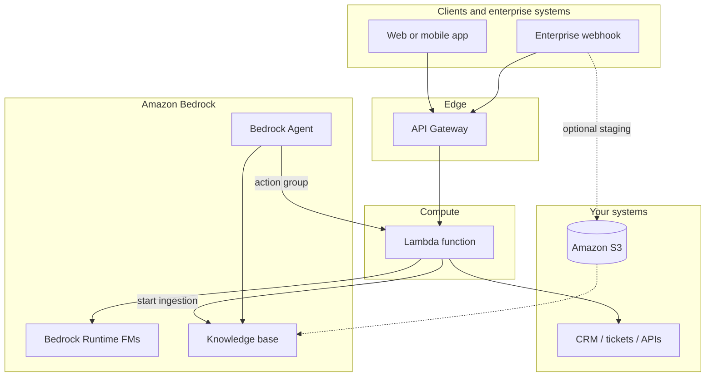
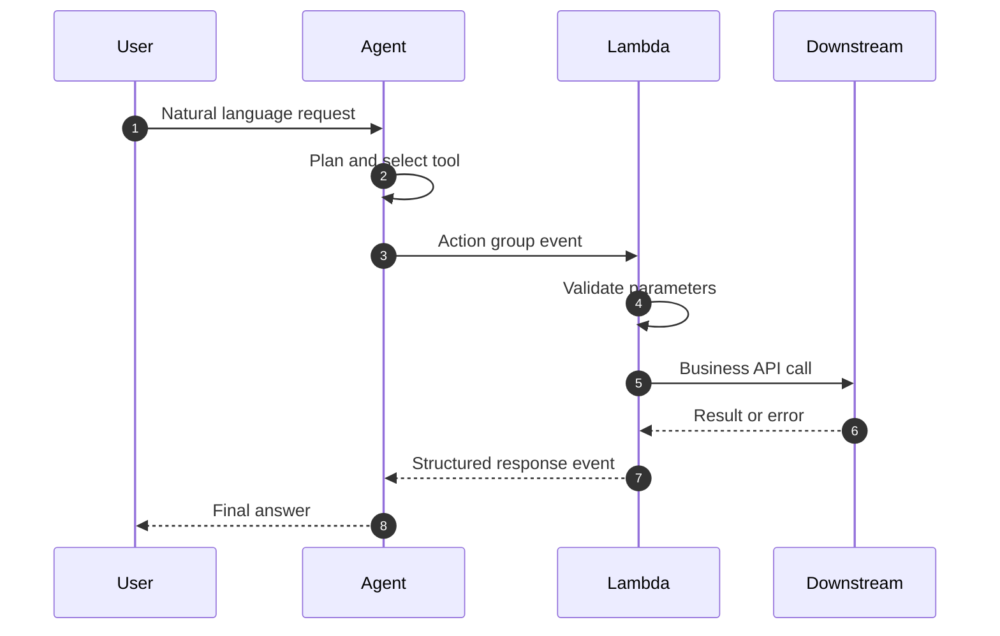
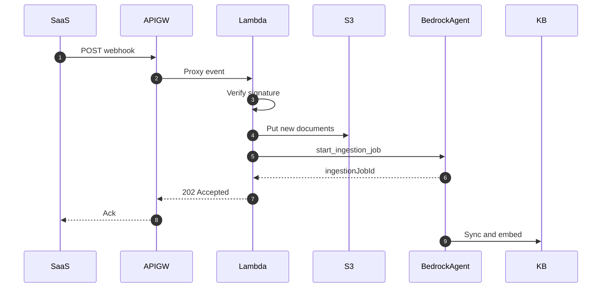

# Lambda with Bedrock

## :material-school: What you'll learn

!!! abstract "Learning objectives"
    You will place :simple-amazonaws: <a href="https://docs.aws.amazon.com/lambda/latest/dg/welcome.html">AWS Lambda</a> at the center of <a href="https://docs.aws.amazon.com/bedrock/latest/userguide/what-is-bedrock.html">Amazon Bedrock</a> application patterns—as **tool glue** for <a href="https://docs.aws.amazon.com/bedrock/latest/userguide/agents.html">Bedrock Agents</a>, as a **serverless inference facade** over foundation models, as a **webhook handler** that kicks off knowledge-base ingestion, and as the **compute behind API Gateway** for GenAI HTTP APIs.

## :material-book-open-variant: Key definitions

| Term | Definition |
|---|---|
| <a href="https://docs.aws.amazon.com/bedrock/latest/userguide/agents-action-add.html">**Action group**</a> | A Bedrock Agent capability backed by an OpenAPI schema, function details, or **return control**—often implemented with a Lambda function that runs your business logic when the agent selects a tool. |
| <a href="https://docs.aws.amazon.com/bedrock/latest/userguide/agents-lambda.html">**Agent tool Lambda**</a> | A function Bedrock invokes with a structured **input event** (`actionGroup`, `apiPath` or `function`, `parameters`, session attributes); your code validates inputs, calls downstream systems, and returns a **response event** the agent can use in further orchestration. |
| **FM invocation facade** | Lambda code that calls <a href="https://docs.aws.amazon.com/bedrock/latest/userguide/conversation-inference.html">Bedrock Runtime</a> (`converse`, `converse_stream`, or `invoke_model`) so applications do not hard-code a single model ID—swap models via configuration without redeploying clients. |
| <a href="https://docs.aws.amazon.com/bedrock/latest/userguide/kb-how-data.html">**Knowledge base ingestion**</a> | The process of syncing or ingesting source documents into a Bedrock knowledge base so retrieval-augmented generation can use your data. |
| <a href="https://docs.aws.amazon.com/bedrock/latest/userguide/kb-data-source-sync-ingest.html">**Ingestion job**</a> | A managed sync that indexes new or changed content from a connected data source; you can start one programmatically (for example after a webhook signals fresh data). |
| <a href="https://docs.aws.amazon.com/apigateway/latest/developerguide/set-up-lambda-proxy-integrations.html">**Lambda proxy integration**</a> | API Gateway forwards the full HTTP request to Lambda as a JSON **event**; Lambda returns a JSON object with `statusCode`, `headers`, and `body` for the HTTP response. |

## :material-scale-balance: Key distinctions / comparisons

| Item | Notes |
|---|---|
| **Agent tool Lambda vs direct `converse`** | Tool Lambdas implement **agent-chosen actions** (CRM lookup, ticket create, custom APIs). Direct Runtime calls implement **your** chat/completion path without the agent orchestration loop. |
| **Bedrock Agents vs custom Lambda orchestration** | Agents manage planning, action selection, and knowledge-base calls. A single Lambda can orchestrate `converse` + `retrieve` yourself when you want full control—more code, more flexibility. |
| **Synchronous API path vs async ingestion** | API Gateway + Lambda usually serves **interactive** requests (low latency). Webhook → `start_ingestion_job` is **asynchronous**—acknowledge the webhook quickly, let ingestion run in the background. |
| **Serverless stack depth** | Lambda calling Bedrock is **serverless on serverless**: no EC2 fleet for glue, no provisioned inference capacity for standard on-demand model access—pay per invocation and token. |
| **Validation in Lambda vs in the agent prompt** | Rely on the model for parameter correctness and you get fragile tools. Validate types, ranges, and authorization **in code** before side effects. |

## Why Lambda belongs in your Bedrock architecture

- 🧩 **Many integration points** — Bedrock rarely sits alone; you connect agents, knowledge bases, enterprise systems, and HTTP clients. Lambda is the default **glue** when services do not integrate natively.
- 🔒 **Guardrails in code** — Tool handlers are where you enforce **well-formed requests**, **parameter validation**, and **error handling** before databases or external APIs change state.
- ⚡ **No capacity planning for inference** — Calling Bedrock from Lambda uses **on-demand** foundation models; you are not provisioning GPU clusters for each API call.
- 🌐 **Enterprise and SaaS signals** — Webhooks from internal platforms or vendors can land on Lambda and **trigger ingestion** or downstream workflows without always-on servers.
- 📡 **Stable HTTP front door** — <a href="https://docs.aws.amazon.com/apigateway/latest/developerguide/welcome.html">Amazon API Gateway</a> terminates TLS, throttles, and authenticates; Lambda implements the GenAI logic behind `POST /query` style routes.

!!! info "Same serverless mindset as the rest of Section 6"
    You already use Lambda as integration glue for analytics and streams in [Lambda Integration](../02-lambda-integration/index.md). With Bedrock, that glue pattern extends to **agents, models, and knowledge bases**—the triggers change; the idea (short-lived code between managed services) does not.

## Four roles Lambda plays with Bedrock

| Role | Typical trigger | What your function does |
|---|---|---|
| **Agent tool implementation** | Bedrock Agent invokes action group | Validate parameters; call CRM, ticketing, or internal APIs; return structured results to the agent. |
| **Application inference layer** | API Gateway, direct invoke, or internal service | Call `bedrock-runtime` `converse` / `invoke_model`; abstract `modelId`; map errors to client-friendly responses. |
| **Webhook → knowledge refresh** | HTTP webhook (often via API Gateway) | Verify payload; optionally stage files in S3; call `bedrock-agent` `start_ingestion_job` for the knowledge base data source. |
| **Public GenAI API backend** | API Gateway proxy integration | Parse JSON body; run retrieval + generation or agent `invoke_agent`; stream or buffer the response. |



## Agent action groups: your tool implementation

When you attach a Lambda function to an <a href="https://docs.aws.amazon.com/bedrock/latest/userguide/agents-action-add.html">action group</a>, Bedrock sends a versioned event with the user’s `inputText`, session identifiers, and the **parameters** the model extracted for the selected API operation or function. Your job is to:

- ✅ Confirm required parameters exist and match expected **types** and **ranges**.
- ✅ Enforce **authorization** (tenant ID, role, resource ownership) before mutating data.
- ✅ Call downstream APIs and map failures to the **response format** Bedrock expects (`httpStatusCode`, `responseState`, or structured `responseBody`).
- ✅ Return data the agent can cite in its reply to the user.



!!! warning "Exam trap: the model is not your validator"
    Bedrock Agents **elicit** parameters from conversation—they do not replace server-side validation. Always treat tool Lambda as **trusted application code**: reject bad input before writes, and return explicit error bodies the agent can explain safely.

### :simple-python: Handler sketch for an API-schema action group

The event shape is documented in <a href="https://docs.aws.amazon.com/bedrock/latest/userguide/agents-lambda.html">Configure Lambda functions for action groups</a>. A minimal pattern validates `parameters`, calls your backend, and returns `messageVersion` `1.0`:

```python
import json

def lambda_handler(event, context):
  # Bedrock action-group event (API schema style)
  action_group = event["actionGroup"]
  api_path = event.get("apiPath", "")
  params = {p["name"]: p["value"] for p in event.get("parameters", [])}

  order_id = params.get("orderId")
  if not order_id:
    return _agent_response(action_group, api_path, 400, {"error": "orderId required"})

  # Call your order service (illustrative)
  order = lookup_order(order_id)

  return _agent_response(action_group, api_path, 200, order)


def _agent_response(action_group, api_path, status_code, body_obj):
  return {
    "messageVersion": "1.0",
    "response": {
      "actionGroup": action_group,
      "apiPath": api_path,
      "httpMethod": "GET",
      "httpStatusCode": status_code,
      "responseBody": {
        "application/json": {"body": json.dumps(body_obj)},
      },
    },
  }
```

!!! success "What good tool code returns"
    A `200` with a JSON `responseBody` gives the agent factual grounding (“order 48291 shipped Tuesday”). A `400` with a clear error message lets the agent ask the user for a valid order ID instead of hallucinating status.

## Direct foundation model calls from Lambda

A Lambda function can sit between your application and Bedrock as a **thin inference layer**:

- Read the user prompt from the invoking event (API Gateway body, Step Functions input, etc.).
- Call <a href="https://docs.aws.amazon.com/bedrock/latest/userguide/conversation-inference.html">Converse</a> with a `modelId` from environment variables or <a href="https://docs.aws.amazon.com/appconfig/latest/userguide/what-is-appconfig.html">AWS AppConfig</a> (covered later in [Dynamic FM Selection with AppConfig](../07-dynamic-fm-selection-with-appconfig/index.md)).
- Return text (or stream tokens if you use `converse_stream` and API Gateway response streaming).

Because both Lambda and Bedrock are **serverless**, you invoke foundation models **without provisioning** inference clusters—ideal for bursty chat, summarization, or classification behind an API.

```python
import json
import os

import boto3

client = boto3.client("bedrock-runtime", region_name=os.environ["AWS_REGION"])

def lambda_handler(event, context):
  body = json.loads(event.get("body") or "{}")
  user_text = body.get("prompt", "")

  response = client.converse(
    modelId=os.environ["BEDROCK_MODEL_ID"],  # swap models without client changes
    messages=[{"role": "user", "content": [{"text": user_text}]}],
    inferenceConfig={"maxTokens": 512, "temperature": 0.3},
  )
  answer = response["output"]["message"]["content"][0]["text"]
  return {"statusCode": 200, "body": json.dumps({"answer": answer})}
```

!!! info "IAM for Runtime from Lambda"
    The function execution role needs `bedrock:InvokeModel` / Converse permissions on the chosen foundation models (and often `aws:SourceAccount` / KMS conditions in regulated environments). Bedrock Agents use a **separate** service role plus a **resource-based policy** on the tool Lambda—see <a href="https://docs.aws.amazon.com/bedrock/latest/userguide/agents-permissions.html">service roles for Bedrock Agents</a>.

## Webhooks that refresh a knowledge base

Enterprise and SaaS systems often emit **webhooks** when new documents or records are ready. A common pattern:

1. Webhook hits **API Gateway** → **Lambda**.
2. Lambda validates signature or token, optionally copies payloads to <a href="https://docs.aws.amazon.com/AmazonS3/latest/userguide/Welcome.html">Amazon S3</a>.
3. Lambda calls <a href="https://docs.aws.amazon.com/bedrock/latest/APIReference/API_agent_StartIngestionJob.html">StartIngestionJob</a> on the knowledge base **data source** so Bedrock re-indexes new content.



```python
import boto3

agent = boto3.client("bedrock-agent", region_name="us-east-1")

def lambda_handler(event, context):
  # After validating webhook and landing files in the data source location:
  response = agent.start_ingestion_job(
    knowledgeBaseId="<knowledge-base-id>",
    dataSourceId="<data-source-id>",
    # Optional clientToken for idempotency on retries
  )
  job_id = response["ingestionJob"]["ingestionJobId"]
  return {"statusCode": 202, "body": json.dumps({"ingestionJobId": job_id})}
```

!!! warning "Do not block the webhook on full ingestion"
    Ingestion can take minutes. Return **202 Accepted** (or similar) after **starting** the job; monitor job status with <a href="https://docs.aws.amazon.com/bedrock/latest/userguide/kb-data-source-sync-ingest.html">sync and ingest APIs</a> or EventBridge—not by holding the webhook HTTP connection open until indexing finishes.

## API Gateway as the front door to your AI system

For browser, mobile, or partner HTTP clients, **API Gateway + Lambda** is often the better option than exposing Bedrock directly:

- API Gateway handles **routing**, **throttling**, **API keys**, and **WAF** integration.
- Lambda receives the **JSON event** from a <a href="https://docs.aws.amazon.com/apigateway/latest/developerguide/set-up-lambda-proxy-integrations.html">Lambda proxy integration</a>, calls Bedrock (or a Bedrock Agent), and **routes and formats** the correct HTTP response (`statusCode`, headers, `body`).
- For streaming completions, consider <a href="https://docs.aws.amazon.com/apigateway/latest/developerguide/response-transfer-mode-lambda.html">response streaming</a> with `converse_stream` so time-to-first-token improves for chat UIs.

```python
import json
import boto3

runtime = boto3.client("bedrock-runtime", region_name="us-east-1")

def lambda_handler(event, context):
  try:
    body = json.loads(event.get("body") or "{}")
    prompt = body["prompt"]
  except (KeyError, json.JSONDecodeError):
    return {"statusCode": 400, "body": json.dumps({"error": "Invalid JSON or missing prompt"})}

  result = runtime.converse(
    modelId="anthropic.claude-3-5-sonnet-20241022-v2:0",
    messages=[{"role": "user", "content": [{"text": prompt}]}],
  )
  text = result["output"]["message"]["content"][0]["text"]
  return {
    "statusCode": 200,
    "headers": {"Content-Type": "application/json"},
    "body": json.dumps({"answer": text}),
  }
```

## :material-alert: Limitations / edge cases

!!! warning "Lambda timeout vs long agent or ingestion work"
    Lambda has a **maximum 15-minute** timeout. Agent orchestration with many tool calls, or waiting for ingestion to finish inside the same invocation, can hit that limit. **Start** long work asynchronously; keep interactive API Lambdas focused on a single model turn or a quick tool call.

!!! warning "Payload and response size caps"
    API Gateway and Lambda impose payload limits; Bedrock agent tool responses must fit within Lambda’s **synchronous invocation payload** quota. Stream large downloads to S3 and return references, not multi-megabyte blobs in the agent response body.

- ⏱️ **Cold starts** — First request after idle may add latency; use provisioned concurrency for strict SLAs on hot chat endpoints.
- 🔁 **Idempotent webhooks** — Vendors retry deliveries; use idempotency keys and conditional writes before starting duplicate ingestion jobs.
- 🔒 **Two permission planes** — Your **Lambda execution role** (Runtime, S3, `bedrock-agent` APIs) is separate from the **Bedrock Agent service role** and the **resource policy** that lets Bedrock invoke tool Lambdas—misconfiguring either breaks the flow.
- 🌍 **Regional alignment** — Create the `bedrock-runtime` and `bedrock-agent` clients in the same Region as your models and knowledge base.

## :material-lightbulb: Key takeaways

- 🔑 Lambda’s **primary Bedrock role** is glue—especially **action-group tools** for agents, with validation and error handling in your code.
- ⚡ A Lambda **inference facade** calls Bedrock Runtime so clients stay model-agnostic while you stay serverless end to end.
- 📥 **Webhooks → ingestion jobs** keep knowledge bases fresh when enterprise systems publish new data—acknowledge fast, ingest asynchronously.
- 📡 **API Gateway + Lambda** is the common HTTP pattern: parse JSON events, call Bedrock, return properly shaped proxy responses (stream when chat latency matters).
- 💰 You combine **pay-per-use** Lambda with **on-demand** Bedrock—no inference cluster provisioning for standard patterns.

## Industry scenarios

- 🏥 **Clinical document assistant** — A Bedrock Agent action group Lambda validates patient context, queries an on-prem FHIR API via private connectivity, and returns structured results; a separate API Gateway + Lambda path serves clinician chat with `converse` while agents handle tool-heavy workflows.
- 🏦 **Policy Q&A with fresh regulatory PDFs** — A compliance vendor webhook notifies Lambda when new circulars land; Lambda stores files in S3 and starts a knowledge-base **ingestion job** so the agent’s retrieval index updates before the next customer question.
- 🛒 **E-commerce support API** — Mobile apps call API Gateway; Lambda routes simple FAQs to a fast Haiku model and escalates returns/refunds to an agent with tool Lambdas that call order and inventory services—model IDs live in environment variables for safe rollouts.

## :material-link-variant: Internal References

- [AWS Lambda](../01-aws-lambda/index.md)
- [Lambda Integration](../02-lambda-integration/index.md)
- [Amazon API Gateway](../04-amazon-api-gateway/index.md)
- [Amazon API Gateway and Generative AI Applications](../05-amazon-api-gateway-and-generative-ai-applications/index.md)
- [Dynamic FM Selection with AppConfig](../07-dynamic-fm-selection-with-appconfig/index.md)
- [Using Comprehend, Lambda, and Bedrock together](../../section-2/15-using-comprehend-lambda-and-bedrock-together/index.md)
- [Section 6: Building Applications Around Your AI System](../index.md)

## External References

- :fontawesome-solid-link: <a href="https://docs.aws.amazon.com/lambda/latest/dg/welcome.html">What is AWS Lambda?</a>
- :fontawesome-solid-link: <a href="https://docs.aws.amazon.com/bedrock/latest/userguide/what-is-bedrock.html">What is Amazon Bedrock?</a>
- :fontawesome-solid-link: <a href="https://docs.aws.amazon.com/bedrock/latest/userguide/agents.html">Amazon Bedrock Agents</a>
- :fontawesome-solid-link: <a href="https://docs.aws.amazon.com/bedrock/latest/userguide/agents-how.html">How Amazon Bedrock Agents works</a>
- :fontawesome-solid-link: <a href="https://docs.aws.amazon.com/bedrock/latest/userguide/agents-action-add.html">Add an action group to your agent</a>
- :fontawesome-solid-link: <a href="https://docs.aws.amazon.com/bedrock/latest/userguide/agents-lambda.html">Configure Lambda functions for action groups</a>
- :fontawesome-solid-link: <a href="https://docs.aws.amazon.com/bedrock/latest/userguide/agents-permissions.html">Create a service role for Amazon Bedrock Agents</a>
- :fontawesome-solid-link: <a href="https://docs.aws.amazon.com/bedrock/latest/userguide/conversation-inference.html">Inference using the Converse API</a>
- :fontawesome-solid-link: <a href="https://docs.aws.amazon.com/bedrock/latest/APIReference/API_runtime_Converse.html">Converse API reference</a>
- :fontawesome-solid-link: <a href="https://docs.aws.amazon.com/bedrock/latest/userguide/kb-how-data.html">Turning data into a knowledge base</a>
- :fontawesome-solid-link: <a href="https://docs.aws.amazon.com/bedrock/latest/userguide/kb-data-source-sync-ingest.html">Sync your data with your knowledge base</a>
- :fontawesome-solid-link: <a href="https://docs.aws.amazon.com/bedrock/latest/APIReference/API_agent_StartIngestionJob.html">StartIngestionJob API reference</a>
- :fontawesome-solid-link: <a href="https://docs.aws.amazon.com/apigateway/latest/developerguide/welcome.html">What is Amazon API Gateway?</a>
- :fontawesome-solid-link: <a href="https://docs.aws.amazon.com/apigateway/latest/developerguide/set-up-lambda-proxy-integrations.html">Lambda proxy integrations in API Gateway</a>
- :fontawesome-solid-link: <a href="https://docs.aws.amazon.com/apigateway/latest/developerguide/response-transfer-mode-lambda.html">Lambda proxy integration with response streaming</a>
- :fontawesome-solid-link: <a href="https://docs.aws.amazon.com/lambda/latest/dg/services-apigateway-tutorial.html">Tutorial: Using Lambda with API Gateway</a>
