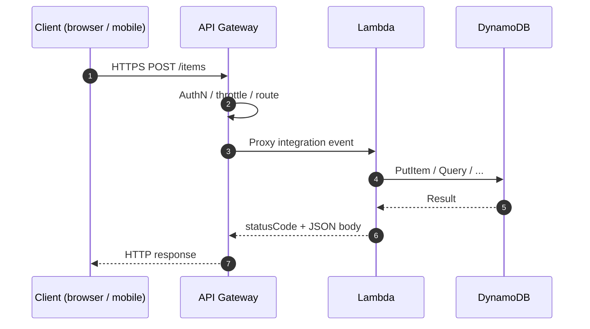
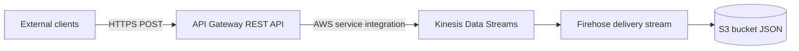
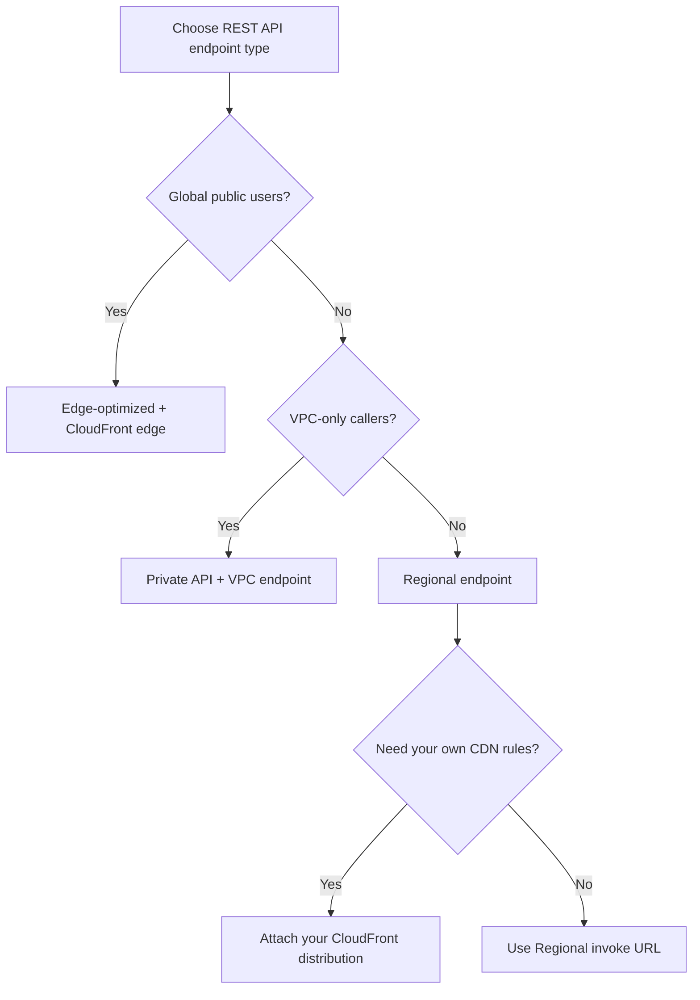

# Amazon API Gateway

## :material-school: What you'll learn

!!! abstract "Learning objectives"
    You will place :simple-amazonaws: <a href="https://docs.aws.amazon.com/apigateway/latest/developerguide/welcome.html">Amazon API Gateway</a> in front of your serverless backends—especially <a href="https://docs.aws.amazon.com/lambda/latest/dg/welcome.html">AWS Lambda</a> and <a href="https://docs.aws.amazon.com/amazondynamodb/latest/developerguide/Introduction.html">Amazon DynamoDB</a> CRUD APIs—so external clients get a managed HTTPS front door with authentication, throttling, stages, and optional real-time <a href="https://docs.aws.amazon.com/apigateway/latest/developerguide/apigateway-websocket-api.html">WebSocket</a> support instead of calling Lambda directly.

## :material-book-open-variant: Key definitions

| Term | Definition |
|---|---|
| <a href="https://docs.aws.amazon.com/apigateway/latest/developerguide/welcome.html">**Amazon API Gateway**</a> | A fully managed service for creating, publishing, and securing **REST**, **HTTP**, and **WebSocket** APIs at scale—part of AWS’s <a href="https://docs.aws.amazon.com/serverless/latest/devguide/welcome.html">serverless</a> application stack. |
| <a href="https://docs.aws.amazon.com/apigateway/latest/developerguide/how-to-deploy-api.html">**Stage**</a> | A named snapshot of a deployed API (for example `dev`, `test`, `prod`) with its own invoke URL, throttling settings, logging, and optional caching. |
| <a href="https://docs.aws.amazon.com/apigateway/latest/developerguide/set-up-lambda-proxy-integrations.html">**Lambda proxy integration**</a> | API Gateway forwards the **entire HTTP request** to Lambda as a JSON event; your handler returns `statusCode`, `headers`, and `body` for the HTTP response. |
| <a href="https://docs.aws.amazon.com/apigateway/latest/developerguide/api-gateway-api-endpoint-types.html">**Endpoint type**</a> | How clients reach a **REST API**: **edge-optimized** (default, via CloudFront), **regional**, or **private** (VPC-only). |
| <a href="https://docs.aws.amazon.com/apigateway/latest/developerguide/api-gateway-api-usage-plans.html">**Usage plan**</a> | A throttle and quota policy you attach to API **stages** and associate with **API keys** to meter third-party or tiered access. |
| <a href="https://docs.aws.amazon.com/apigateway/latest/developerguide/apigateway-use-lambda-authorizer.html">**Custom authorizer**</a> | A Lambda function API Gateway calls **before** the integration to implement your own auth logic (tokens, OAuth, SAML, etc.) and return an IAM policy. |

## :material-scale-balance: Key distinctions / comparisons

| Item | Notes |
|---|---|
| **Direct Lambda invoke vs <a href="https://docs.aws.amazon.com/lambda/latest/dg/urls-configuration.html">function URL</a> vs API Gateway** | SDK `Invoke` is for **programmatic** callers with AWS credentials. A **function URL** is a simple dedicated HTTPS endpoint on the function. **API Gateway** adds routing, auth, usage plans, WAF, stages, and consistent public API design—see <a href="https://docs.aws.amazon.com/lambda/latest/dg/furls-http-invoke-decision.html">choosing an HTTP invoke method</a>. |
| **Lambda vs HTTP vs AWS service integration** | **Lambda** is the most common pattern for serverless business logic. **HTTP** integration proxies to existing HTTP backends (on-premises or in the cloud) while you still get Gateway features. **AWS service** integration calls services like <a href="https://docs.aws.amazon.com/streams/latest/dev/introduction.html">Kinesis Data Streams</a>, <a href="https://docs.aws.amazon.com/AWSSimpleQueueService/latest/SQS-Welcome.html">Amazon SQS</a>, or <a href="https://docs.aws.amazon.com/step-functions/latest/dg/welcome.html">AWS Step Functions</a> without a Lambda in the middle. |
| **Edge-optimized vs regional vs private** | **Edge-optimized** routes global clients through <a href="https://docs.aws.amazon.com/AmazonCloudFront/latest/DeveloperGuide/Introduction.html">CloudFront</a> edge locations (API still lives in one Region). **Regional** serves clients in that Region without the built-in CloudFront front door (you can attach your own distribution). **Private** APIs are reachable only inside your VPC via interface endpoints. |
| **Authentication vs authorization** | **Authentication** proves *who* the caller is (IAM SigV4, Cognito tokens, custom authorizer). **Authorization** decides *what* they may do (IAM policies, authorizer output, resource policies). API Gateway supports both layers—see <a href="https://docs.aws.amazon.com/apigateway/latest/developerguide/apigateway-control-access-to-api.html">control access to REST APIs</a>. |

## Why you need a managed API layer

You already know how to build **Lambda + DynamoDB** backends that create, read, update, and delete records. The missing piece is a **safe, stable way for browsers, mobile apps, and partners to call that logic over the internet** without handing out AWS access keys.

- 🌐 **Public HTTPS by default** — Clients speak HTTP/HTTPS; API Gateway terminates TLS and maps paths and methods to integrations.
- 🔒 **Security and governance in one place** — IAM, Cognito, Lambda authorizers, API keys, usage plans, and <a href="https://docs.aws.amazon.com/apigateway/latest/developerguide/apigateway-resource-policies.html">resource policies</a> instead of bolting auth onto every function.
- 📊 **Operations you do not want in application code** — Throttling, request/response transformation, caching, stages for **dev / test / prod**, and <a href="https://docs.aws.amazon.com/AmazonCloudWatch/latest/monitoring/working_with_metrics.html">Amazon CloudWatch</a> metrics for every API call.
- ⚡ **Beyond a bare HTTP endpoint** — Rate limiting in front of fragile backends, mediation before calling AWS services, and <a href="https://docs.aws.amazon.com/apigateway/latest/developerguide/apigateway-websocket-api.html">WebSocket APIs</a> for bidirectional real-time apps.

!!! info "Where this fits in Section 6"
    [AWS Lambda](../01-aws-lambda/index.md) runs your code; [Lambda Integration](../02-lambda-integration/index.md) connects it to event sources. API Gateway is the **north–south HTTP front door** those functions often need before you add Bedrock in [Lambda with Bedrock](../03-lambda-with-bedrock/index.md) and [API Gateway and Generative AI Applications](../05-amazon-api-gateway-and-generative-ai-applications/index.md).

## Three ways clients can reach your Lambda

| Approach | Best when | Trade-off |
|---|---|---|
| **AWS SDK `lambda:Invoke`** | Internal automation, same-account services | Not a public REST API; callers need AWS credentials and SDK setup. |
| **<a href="https://docs.aws.amazon.com/lambda/latest/dg/urls-invocation.html">Lambda function URL</a>** | Quick webhooks, prototypes, single-function HTTP | Minimal API management—auth and throttling are mostly your problem. |
| **<a href="https://docs.aws.amazon.com/apigateway/latest/developerguide/welcome.html">API Gateway</a> + Lambda** | Production REST/HTTP APIs, mobile and web clients | More configuration; you gain stages, authorizers, usage plans, and WAF integration. |



For a DynamoDB-backed CRUD API, your Lambda handler behind a **proxy integration** parses the API Gateway event and returns a proper HTTP envelope:

```python
import json
import boto3

dynamodb = boto3.resource("dynamodb", region_name="us-east-1")
table = dynamodb.Table("<items-table>")

def lambda_handler(event, context):
    http_method = event["httpMethod"]
    path_params = event.get("pathParameters") or {}

    if http_method == "POST":
        body = json.loads(event.get("body") or "{}")
        table.put_item(Item={"id": body["id"], "data": body["data"]})
        return {"statusCode": 201, "body": json.dumps({"ok": True})}

    if http_method == "GET" and path_params.get("id"):
        resp = table.get_item(Key={"id": path_params["id"]})
        item = resp.get("Item")
        if not item:
            return {"statusCode": 404, "body": json.dumps({"error": "Not found"})}
        return {"statusCode": 200, "body": json.dumps(item)}

    return {"statusCode": 400, "body": json.dumps({"error": "Unsupported route"})}
```

See <a href="https://docs.aws.amazon.com/lambda/latest/dg/services-apigateway-tutorial.html">Tutorial: Using Lambda with API Gateway</a> for wiring permissions, resources, methods, and deployment.

## What API Gateway adds beyond “call my function”

| Capability | Why you care |
|---|---|
| **Authentication & authorization** | IAM SigV4 for internal callers; <a href="https://docs.aws.amazon.com/cognito/latest/developerguide/cognito-user-pools.html">Amazon Cognito</a> user pools for mobile/web; <a href="https://docs.aws.amazon.com/apigateway/latest/developerguide/apigateway-use-lambda-authorizer.html">Lambda authorizers</a> for custom token logic. |
| **API keys & usage plans** | Meter partners or SaaS tiers with throttles and quotas—<a href="https://docs.aws.amazon.com/apigateway/latest/developerguide/api-gateway-api-usage-plans.html">usage plans and API keys</a>. |
| **Stages (dev / test / prod)** | Same API definition, different deployed URLs and settings per environment. |
| **OpenAPI / Swagger** | <a href="https://docs.aws.amazon.com/apigateway/latest/developerguide/api-gateway-import-api.html">Import</a> or <a href="https://docs.aws.amazon.com/apigateway/latest/developerguide/api-gateway-export-api.html">export</a> OpenAPI 3.0 definitions; generate SDKs and keep API contracts versioned. |
| **Request/response mapping** | Validate and transform payloads at the edge so backends receive clean shapes—see <a href="https://docs.aws.amazon.com/apigateway/latest/developerguide/api-gateway-integration-settings-integration-response.html">integration responses</a>. |
| **Caching** | Reduce load on backends with <a href="https://docs.aws.amazon.com/apigateway/latest/developerguide/api-gateway-caching.html">stage- or method-level cache</a>. |
| **WebSocket APIs** | Real-time chat, live dashboards, or streaming control channels without long-polling HTTP. |

Deploy a stage programmatically when you automate releases:

```python
import boto3

apigw = boto3.client("apigateway", region_name="us-east-1")

deployment = apigw.create_deployment(
    restApiId="<rest-api-id>",
    stageName="prod",
    description="Promote tested build to production",
)
# deployment["id"] identifies this deployment snapshot
```

Export the deployed API as OpenAPI 3.0 for clients and CI:

```python
export_blob = apigw.get_export(
    restApiId="<rest-api-id>",
    stageName="prod",
    exportType="oas30",  # OpenAPI 3.0
    accepts="application/json",
)["body"].read()
open("api-prod-oas30.json", "wb").write(export_blob)
```

## Integration patterns

### Lambda integration (most common)

You expose a **REST API backed by Lambda** for full **serverless** compute: no servers to patch, pay per request. This is the default pattern for CRUD APIs, BFF layers, and GenAI HTTP facades.

### HTTP integration

You can front **any HTTP endpoint**—an on-premises service or an existing app in AWS—so callers still hit API Gateway while the backend stays where it is. You adopt Gateway for **rate limiting**, **authentication**, and **consistent public URLs** without moving the app.

Tutorial: <a href="https://docs.aws.amazon.com/apigateway/latest/developerguide/api-gateway-create-api-as-simple-proxy-for-http.html">REST API with HTTP proxy integration</a>.

### AWS service integration

API Gateway can invoke AWS APIs **directly**—for example start a Step Functions execution, send a message to SQS, or write to Kinesis—when you want **mediation** (auth, throttling, public HTTP) without Lambda glue code.

!!! success "Pattern: ingest via API Gateway without giving out AWS keys"
    Partners send **HTTPS JSON** to API Gateway; Gateway assumes an IAM role and calls `PutRecord` on <a href="https://docs.aws.amazon.com/streams/latest/dev/introduction.html">Kinesis Data Streams</a>. Downstream, <a href="https://docs.aws.amazon.com/firehose/latest/dev/what-is-this-service.html">Kinesis Data Firehose</a> can land batched records in <a href="https://docs.aws.amazon.com/AmazonS3/latest/userguide/Welcome.html">Amazon S3</a>—all serverless, no EC2 fleet managing ingress.



Walkthrough: <a href="https://docs.aws.amazon.com/apigateway/latest/developerguide/integrating-api-with-aws-services-kinesis.html">REST API as a Kinesis proxy</a>.

## REST API endpoint types

| Endpoint type | Behavior | Typical use |
|---|---|---|
| **Edge-optimized** (default) | Global clients; requests enter via **CloudFront edge** locations for lower latency; API resource remains in the Region where you created it. | Public APIs with worldwide users. |
| **Regional** | No built-in CloudFront front door from API Gateway; clients hit the Regional API endpoint directly. You **may** attach your own CloudFront distribution for custom caching behavior. | Users concentrated in one Region; more control over CDN settings. |
| **Private** | Callable only from your **VPC** using **interface VPC endpoints** (PrivateLink). Access is further constrained with a <a href="https://docs.aws.amazon.com/apigateway/latest/developerguide/apigateway-resource-policies.html">resource policy</a>. | Internal microservices, private SaaS integrations. |



Details: <a href="https://docs.aws.amazon.com/apigateway/latest/developerguide/api-gateway-api-endpoint-types.html">API endpoint types for REST APIs</a> and <a href="https://docs.aws.amazon.com/apigateway/latest/developerguide/apigateway-private-apis.html">private REST APIs</a>.

## Security: who can call your API

| Mechanism | Caller type | How it works |
|---|---|---|
| **IAM authorization** | Internal AWS workloads (EC2 instance roles, other Lambda functions) | Caller signs requests with **SigV4**; API method uses `AWS_IAM`; policies grant `execute-api:Invoke`—see <a href="https://docs.aws.amazon.com/apigateway/latest/developerguide/permissions.html">IAM permissions for invoking APIs</a>. |
| **Amazon Cognito user pools** | Mobile and web end users | Clients present Cognito **ID or access tokens**; API Gateway validates them with a Cognito authorizer—<a href="https://docs.aws.amazon.com/apigateway/latest/developerguide/apigateway-integrate-with-cognito.html">Cognito authorizer setup</a>. |
| **Lambda custom authorizer** | Any scheme you implement | Your authorizer Lambda inspects headers or query strings and returns an IAM policy allowing or denying the route. |
| **API keys + usage plans** | Partners / metered tiers | Keys identify the client; usage plans enforce throttle and quota—not a substitute for strong auth on sensitive data. |

### Custom domains and TLS

You can present APIs on **your own domain** with HTTPS certificates from <a href="https://docs.aws.amazon.com/acm/latest/userguide/acm-overview.html">AWS Certificate Manager (ACM)</a>:

- **Edge-optimized** APIs: ACM certificate must be in **US East (N. Virginia) `us-east-1`** (paired with CloudFront).
- **Regional** APIs: certificate must be in the **same Region** as the API Gateway stage.

Map DNS with a **CNAME** or **Route 53 alias** record to the API Gateway domain name—<a href="https://docs.aws.amazon.com/apigateway/latest/developerguide/how-to-custom-domains.html">custom domain names for public REST APIs</a> and <a href="https://docs.aws.amazon.com/Route53/latest/DeveloperGuide/resource-record-sets-choosing-alias-non-alias.html">Route 53 alias records</a>.

## :material-alert: Limitations / edge cases

!!! warning "Exam trap: API keys are not user identity"
    API keys identify **applications** or **subscription tiers** for throttling and usage plans. They do **not** replace Cognito, IAM, or authorizers for proving *which human* is calling a protected API.

!!! warning "Exam trap: ACM Region for custom domains"
    **Edge-optimized** → certificate in **`us-east-1`**. **Regional** → certificate in the **API’s Region**. Mixing these up is a common certification mistake.

!!! warning "Private API networking"
    Private REST APIs require callers inside the VPC (or connected networks) to use the correct **interface VPC endpoint**. Combine with a **resource policy** that restricts `aws:SourceVpce` or source VPC—see <a href="https://docs.aws.amazon.com/apigateway/latest/developerguide/apigateway-resource-policies-create-attach.html">attach a resource policy</a>.

- 🔒 **Defense in depth** — Pair authorizers with <a href="https://docs.aws.amazon.com/apigateway/latest/developerguide/rest-api-protect.html">WAF, mTLS, and throttling</a> for internet-facing APIs.
- 💰 **Caching costs** — Stage caching saves backend load but adds **cache capacity** charges; tune TTL and cache key parameters deliberately.

## :material-lightbulb: Key takeaways

- 🔑 API Gateway is the **managed HTTPS layer** between clients and Lambda, HTTP backends, or AWS service integrations—central to serverless application design.
- ⚡ Choose **Lambda proxy** for most app logic; use **AWS service integration** when you need secure public ingress to Kinesis, SQS, Step Functions, and similar services without distributing AWS credentials.
- 🌍 Pick **edge-optimized**, **regional**, or **private** endpoint types based on **audience geography** and **network boundaries**, not habit.
- 🔒 Match auth to caller: **IAM** inside AWS, **Cognito** for consumer apps, **Lambda authorizers** for custom token models—plus API keys for metering when appropriate.
- 📄 Use **OpenAPI import/export** and **stages** so dev, test, and prod stay aligned and client SDKs stay current.

## Industry scenarios

- 🏥 **Patient portal API** — A health system exposes appointment and lab-result APIs through API Gateway with Cognito auth, usage plans per clinic partner, and Lambda + DynamoDB backends—no long-lived servers on the DMZ.
- 🏦 **Partner banking webhooks** — External fintech partners POST transaction events to a **regional** API with Lambda authorizers validating signed JWTs; approved payloads enqueue to SQS for downstream fraud analysis.
- 🛒 **Telemetry ingestion at scale** — A retailer accepts mobile clickstream data via API Gateway’s **Kinesis integration**, streams through Firehose into S3 for analytics, without embedding IAM access keys in mobile apps.

## :material-link-variant: Internal References

- [AWS Lambda](../01-aws-lambda/index.md)
- [Lambda Integration](../02-lambda-integration/index.md)
- [Lambda with Bedrock](../03-lambda-with-bedrock/index.md)
- [Amazon API Gateway and Generative AI Applications](../05-amazon-api-gateway-and-generative-ai-applications/index.md)
- [Section 6: Building Applications Around Your AI System](../index.md)

## External References

- :fontawesome-solid-link: <a href="https://docs.aws.amazon.com/apigateway/latest/developerguide/welcome.html">What is Amazon API Gateway?</a>
- :fontawesome-solid-link: <a href="https://docs.aws.amazon.com/lambda/latest/dg/services-apigateway.html">Invoking Lambda from API Gateway</a>
- :fontawesome-solid-link: <a href="https://docs.aws.amazon.com/lambda/latest/dg/furls-http-invoke-decision.html">Select a method to invoke Lambda over HTTP</a>
- :fontawesome-solid-link: <a href="https://docs.aws.amazon.com/apigateway/latest/developerguide/set-up-lambda-proxy-integrations.html">Lambda proxy integrations for REST APIs</a>
- :fontawesome-solid-link: <a href="https://docs.aws.amazon.com/apigateway/latest/developerguide/api-gateway-api-endpoint-types.html">REST API endpoint types</a>
- :fontawesome-solid-link: <a href="https://docs.aws.amazon.com/apigateway/latest/developerguide/apigateway-private-apis.html">Private REST APIs</a>
- :fontawesome-solid-link: <a href="https://docs.aws.amazon.com/apigateway/latest/developerguide/apigateway-control-access-to-api.html">Control access to REST APIs</a>
- :fontawesome-solid-link: <a href="https://docs.aws.amazon.com/apigateway/latest/developerguide/api-gateway-api-usage-plans.html">Usage plans and API keys</a>
- :fontawesome-solid-link: <a href="https://docs.aws.amazon.com/apigateway/latest/developerguide/integrating-api-with-aws-services-kinesis.html">REST API as a Kinesis proxy</a>
- :fontawesome-solid-link: <a href="https://docs.aws.amazon.com/apigateway/latest/developerguide/apigateway-websocket-api.html">API Gateway WebSocket APIs</a>
- :fontawesome-solid-link: <a href="https://docs.aws.amazon.com/apigateway/latest/developerguide/api-gateway-import-api.html">Develop REST APIs using OpenAPI</a>
- :fontawesome-solid-link: <a href="https://docs.aws.amazon.com/apigateway/latest/developerguide/how-to-custom-domains.html">Custom domain names for REST APIs</a>
- :fontawesome-solid-link: <a href="https://docs.aws.amazon.com/lambda/latest/dg/services-apigateway-tutorial.html">Tutorial: Lambda, API Gateway, and DynamoDB</a>
