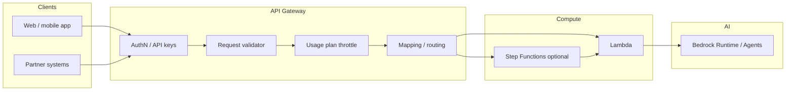
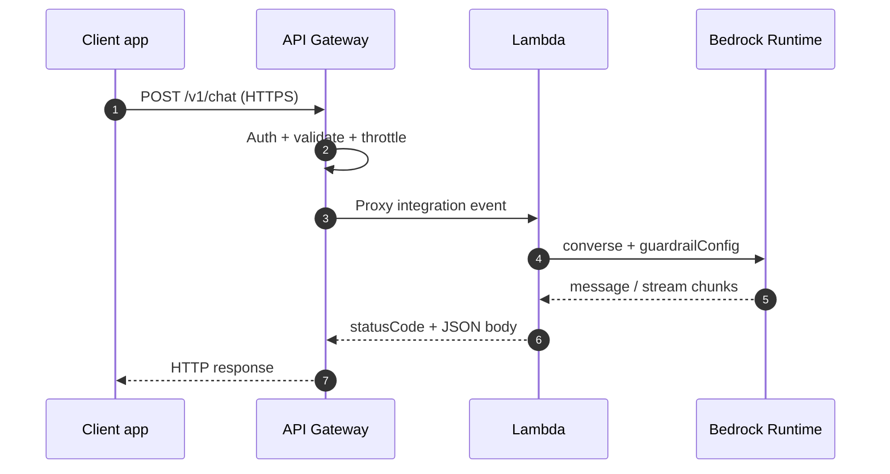
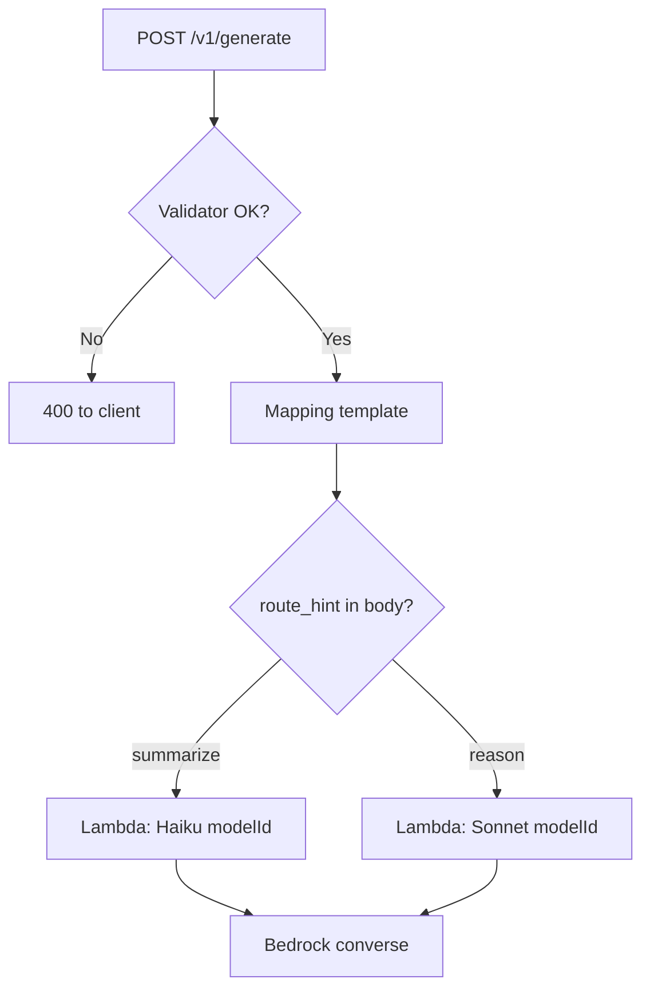

# Amazon API Gateway and Generative AI Applications

## :material-school: What you'll learn

!!! abstract "Learning objectives"
    You will map every major way :simple-amazonaws: <a href="https://docs.aws.amazon.com/apigateway/latest/developerguide/welcome.html">Amazon API Gateway</a> wraps a <a href="https://docs.aws.amazon.com/bedrock/latest/userguide/what-is-bedrock.html">generative AI</a> workload on AWS—from **human feedback APIs** and a **public model front door** through **usage-plan throttling**, **request validation**, **routing transforms**, **response filtering**, and **timeout/retry patterns**—so traffic, shape, and safety are governed before prompts reach <a href="https://docs.aws.amazon.com/bedrock/latest/userguide/conversation-inference.html">Bedrock Runtime</a>.

## :material-book-open-variant: Key definitions

| Term | Definition |
|---|---|
| <a href="https://docs.aws.amazon.com/apigateway/latest/developerguide/welcome.html">**GenAI API edge**</a> | The managed HTTPS layer (API Gateway + authorizers + usage plans) between internet or partner clients and your **Lambda**, **HTTP**, or **Step Functions** backends that call Bedrock. |
| **Feedback collection API** | A small, authenticated HTTP surface (often `POST /feedback`) where users rate outputs (thumbs, stars, free text) so you can improve prompts, retrieval, and routing over time. |
| <a href="https://docs.aws.amazon.com/apigateway/latest/developerguide/api-gateway-api-usage-plans.html">**Usage plan**</a> | A throttle and quota policy tied to **API keys** and stages—used to align **client traffic** with **model quotas** and cost guardrails. |
| <a href="https://docs.aws.amazon.com/apigateway/latest/developerguide/api-gateway-method-request-validation.html">**Request validator**</a> | API Gateway checks body, query, and headers against models (including **JSON Schema**) **before** the integration runs—ideal for blocking oversized prompts. |
| <a href="https://docs.aws.amazon.com/apigateway/latest/developerguide/models-mappings.html">**Mapping template**</a> | A VTL transform on method or integration requests/responses—useful for **routing hints**, header injection, or shaping payloads without changing client contracts. |
| <a href="https://docs.aws.amazon.com/bedrock/latest/userguide/guardrails-how.html">**Guardrail**</a> | Bedrock-managed content and safety policy evaluated on inputs/outputs; API Gateway can add a **supplemental** response filter, but guardrails remain the primary model-side control. |

## :material-scale-balance: Key distinctions / comparisons

| Item | Notes |
|---|---|
| **Call Bedrock from the browser vs API Gateway + Lambda** | Bedrock endpoints expect **AWS SigV4** and account-scoped **IAM**—you do not hand foundation-model credentials to mobile or web clients. API Gateway terminates TLS, authenticates callers, and forwards to Lambda (or similar) that holds `bedrock:InvokeModel` / `bedrock:Converse` permissions—see <a href="https://docs.aws.amazon.com/bedrock/latest/userguide/inference-prereq.html">inference prerequisites</a>. |
| **Guardrails in Bedrock vs filtering at API Gateway** | <a href="https://docs.aws.amazon.com/bedrock/latest/userguide/guardrails-use-converse-api.html">Guardrails on `Converse`</a> evaluate model I/O at inference time. API Gateway **mapping templates** or Lambda can redact or block fields in the **HTTP response** as a last-mile control—defense in depth, not a replacement. |
| **Throttle bots vs protect model TPM** | Usage-plan **rate** and **burst** protect your API account and backends; **Bedrock service quotas** (TPM/RPM per model) are separate—size both from expected traffic and quota math. |
| **Sync API Gateway vs long-running generation** | API Gateway integrations have **timeout limits**; very long generations may need **streaming** (`converse_stream`), **async** patterns (SQS, Step Functions), or WebSocket APIs—do not assume a single synchronous REST call covers multi-minute jobs. |

## Why GenAI needs a dedicated API layer

Generative systems are **subjective** and **expensive**: quality is judged by humans, each call consumes tokens, and abusive or malformed traffic can burn quota fast. A general-purpose API front door still applies—but the controls you emphasize shift toward **feedback**, **throttling aligned to model capacity**, **prompt size limits**, and **safety on the wire**.

- 💬 **Subjective quality** — You need a durable channel for users to say whether an answer helped; that channel is a public API, not a log file.
- 🔒 **No direct Bedrock from external apps** — Partners and browsers hit **your** API; credentials for inference stay in AWS.
- 💰 **Quota-aware traffic** — Match **client rate limits** to **model throughput** and your **Bedrock quotas** so one tenant cannot starve others.
- 🛡️ **Shape and safety before compute** — Reject gigabyte JSON bodies and missing required fields **before** Lambda or Bedrock runs.

!!! info "Where this fits in Section 6"
    You already studied API Gateway mechanics in [Amazon API Gateway](../04-amazon-api-gateway/index.md) and Lambda + Bedrock patterns in [Lambda with Bedrock](../03-lambda-with-bedrock/index.md). This page applies that stack specifically to **GenAI traffic patterns**—feedback, inference, throttling, validation, and routing.

## Eight roles API Gateway plays around GenAI

| Role | What you are protecting or enabling |
|---|---|
| **1. Feedback collection front end** | HTTPS endpoint for ratings and comments tied to `messageId` / `sessionId` for continuous improvement (see also [optimizing FM system performance](../../section-4/08-optimizing-foundation-model-system-performance/index.md#user-feedback-loops)). |
| **2. Public front door to models** | `POST /chat`, `/complete`, or `/agent` routes that invoke Lambda → Bedrock Runtime or `invoke_agent`. |
| **3. Usage-plan traffic management** | Per-client **rate** (e.g. 10–15 RPS) and **burst** (often ~2–3× rate as a starting point) via API keys and usage plans. |
| **4. Response filtering** | Mapping templates or Lambda that strip tokens, PII, or policy-blocked content from responses after guardrails run. |
| **5. Retry / resilience at the edge** | Structured error responses, Step Functions–backed APIs with built-in retries, or Lambda retry logic behind a stable HTTP contract. |
| **6. Token / payload limit enforcement** | Request validators + JSON Schema max lengths on `prompt`, `messages`, or `inputText`. |
| **7. Routing with request transformation** | Mapping templates or headers that pass **model tier**, **task type**, or **locale** to the integration for model selection. |
| **8. Required-field validation** | Validate schemas up front so Bedrock never sees structurally invalid application payloads. |



## Feedback collection at the edge

Your users decide whether an answer was helpful—that signal is how you detect regressions after prompt or model changes. Expose a narrow REST route (for example `POST /v1/feedback`) through API Gateway with the same auth model as your chat API (Cognito JWT, Lambda authorizer, or API key per tenant).

```python
import json
import boto3
from datetime import datetime, timezone

dynamodb = boto3.resource("dynamodb", region_name="us-east-1")
table = dynamodb.Table("<genai-feedback>")

def lambda_handler(event, context):
    # API Gateway Lambda proxy integration event
    body = json.loads(event.get("body") or "{}")
    # message_id ties feedback to a prior inference trace
    table.put_item(
        Item={
            "message_id": body["message_id"],
            "rating": body["rating"],  # e.g. 1 = down, 5 = up
            "comment": body.get("comment", ""),
            "created_at": datetime.now(timezone.utc).isoformat(),
        }
    )
    return {"statusCode": 202, "body": json.dumps({"accepted": True})}
```

Correlate `message_id` with <a href="https://docs.aws.amazon.com/AmazonCloudWatch/latest/monitoring/GenAI-observability.html">GenAI observability</a> traces and <a href="https://docs.aws.amazon.com/wellarchitected/latest/generative-ai-lens/genops01-bp02.html">Well-Architected feedback practices</a> so product and ML teams can find failing conversations quickly.

## Public model access: API Gateway → Lambda → Bedrock

External applications cannot safely call Bedrock with embedded AWS keys. The standard pattern is **API Gateway → Lambda proxy integration → `bedrock-runtime`**, with IAM on the function role and optional **guardrails** on the inference call.



```python
import json
import boto3

bedrock = boto3.client("bedrock-runtime", region_name="us-east-1")

def lambda_handler(event, context):
    body = json.loads(event.get("body") or "{}")
    response = bedrock.converse(
        modelId=body.get("model_id", "anthropic.claude-3-5-haiku-20241022-v1:0"),
        messages=[{"role": "user", "content": [{"text": body["prompt"]}]}],
        guardrailConfig={
            "guardrailIdentifier": "<guardrail-id>",
            "guardrailVersion": "1",
        },  # primary content safety at inference
    )
    text = response["output"]["message"]["content"][0]["text"]
    return {"statusCode": 200, "body": json.dumps({"answer": text})}
```

See <a href="https://docs.aws.amazon.com/apigateway/latest/developerguide/set-up-lambda-proxy-integrations.html">Lambda proxy integrations</a> and [Lambda with Bedrock](../03-lambda-with-bedrock/index.md) for agent, streaming, and ingestion variants.

## Usage plans: align client traffic with model capacity

You already know **account-level** and **stage-level** throttling from the API Gateway fundamentals page. For GenAI, attach **usage plans** to API keys so each customer or internal product line gets limits derived from:

- **Bedrock quotas** (TPM/RPM for the models you route to)
- **Expected concurrent users** and peak RPS
- **Abuse detection** (bots hammering `/chat`)

!!! info "Starting throttle math"
    A practical starting point from production GenAI APIs: set a steady **rate limit** around **10–15 requests per second** per API key for chat-style endpoints, and set **burst** to roughly **2–3×** that rate so short spikes succeed without sustained overload. Tune from CloudWatch `4XX`/`5XX` and Bedrock throttling metrics.

```python
import boto3

apigw = boto3.client("apigateway", region_name="us-east-1")

plan = apigw.create_usage_plan(
    name="GenAI-Partner-Tier",
    description="Throttle partner chat traffic to model capacity",
    throttle={
        "rateLimit": 15.0,   # steady RPS per API key (adjust per tenant)
        "burstLimit": 45,    # ~3x burst bucket for short spikes
    },
    quota={"limit": 50000, "period": "DAY"},  # optional daily cap
)
# Associate plan with API stage + API keys via create_usage_plan_key, etc.
```

Details: <a href="https://docs.aws.amazon.com/apigateway/latest/developerguide/api-gateway-api-usage-plans.html">usage plans and API keys</a>, <a href="https://docs.aws.amazon.com/apigateway/latest/developerguide/api-gateway-request-throttling.html">throttle requests to REST APIs</a>.

## Request validation and token / payload limits

Oversized prompts waste money and can fail unpredictably downstream. Enable a **request validator** on the method and attach a **model** (JSON Schema) that caps string lengths and requires fields your application and model expect.

| Validation target | Example constraint |
|---|---|
| `prompt` or `messages` | `maxLength` on user text (e.g. 32k characters—not gigabytes) |
| `model_id` | `enum` of allowed foundation models |
| `session_id` | Required string for trace correlation |
| `metadata` | Optional object with bounded properties |

API Gateway returns **400** with a clear error when validation fails—**before** Lambda cold start or Bedrock invocation. See <a href="https://docs.aws.amazon.com/apigateway/latest/developerguide/api-gateway-method-request-validation.html">request validation for REST APIs</a>.

!!! success "Validator blocks bad traffic early"
    A client sends a 2 MB pasted document in `prompt`; the validator rejects it with `400 Bad Request`. Your Lambda never runs, Bedrock tokens are not consumed, and CloudWatch shows a validation failure instead of a model timeout.

## Routing and request transformation

When the client already sends enough context to pick a model tier (for example `task_type: "summarize"` vs `"reason"`), API Gateway **mapping templates** can normalize the integration request—set headers, rewrite JSON, or pass **stage variables**—so Lambda reads a consistent event shape.



Your Lambda handler can branch on `event["headers"]` or parsed body fields that mapping templates standardized:

```python
import json
import boto3

bedrock = boto3.client("bedrock-runtime", region_name="us-east-1")

ROUTING = {
    "summarize": "anthropic.claude-3-5-haiku-20241022-v1:0",
    "reason": "anthropic.claude-3-5-sonnet-20241022-v2:0",
}

def lambda_handler(event, context):
    body = json.loads(event.get("body") or "{}")
    task = body.get("task_type", "summarize")
    model_id = ROUTING.get(task, ROUTING["summarize"])
    # mapping template may also set X-Route-Tier header from the same field
    response = bedrock.converse(
        modelId=model_id,
        messages=[{"role": "user", "content": [{"text": body["prompt"]}]}],
    )
    return {
        "statusCode": 200,
        "body": json.dumps({"model_id": model_id, "answer": response["output"]["message"]["content"][0]["text"]}),
    }
```

See <a href="https://docs.aws.amazon.com/apigateway/latest/developerguide/models-mappings.html">mapping template transformations</a> and <a href="https://docs.aws.amazon.com/apigateway/latest/developerguide/request-response-data-mappings.html">parameter mapping examples</a>.

## Response filtering and guardrails

**Bedrock Guardrails** should evaluate content at inference via `guardrailConfig` on <a href="https://docs.aws.amazon.com/bedrock/latest/userguide/guardrails-use-converse-api.html">Converse</a> (input and output policies, prompt-attack filters, PII, etc.). API Gateway can still act as a **last line** on the HTTP response—mapping templates that remove fields, Lambda that redacts token-level segments, or <a href="https://docs.aws.amazon.com/apigateway/latest/developerguide/api-gateway-gatewayResponse-definition.html">gateway responses</a> that normalize error bodies so clients never see raw stack traces.

!!! warning "Exam trap: API Gateway is not your primary guardrail"
    Certification questions often pair **Guardrails** with **Bedrock Runtime** APIs. API Gateway filtering is supplemental—use guardrails for model-policy enforcement, API Gateway for transport-level shaping and stable client contracts.

## Retry strategies when models time out

Bedrock or Lambda may return timeouts under load. Options at or behind API Gateway include:

- **Lambda code** — SDK retries with backoff for transient `ThrottlingException` (most common for chat APIs).
- **Step Functions integration** — Expose `StartSyncExecution` or async execution via API Gateway; state machine **Retry** policies handle transient failures with controlled backoff—see <a href="https://docs.aws.amazon.com/step-functions/latest/dg/tutorial-api-gateway.html">Step Functions API with API Gateway</a>.
- **Gateway responses** — Map integration **504/502** to a JSON body that tells clients whether to retry safely (`Retry-After`, idempotency keys).

!!! warning "Sync timeout ceiling"
    Long synchronous generations can exceed API Gateway–Lambda integration timeouts. Prefer **streaming** responses, **async** job IDs (`202` + poll), or Step Functions for multi-step agent flows instead of blocking a single REST call until the model finishes a very large job.

## :material-alert: Limitations / edge cases

!!! warning "Exam trap: API keys vs human identity"
    API keys meter **applications** and usage plans—they do not prove **which user** submitted feedback or a prompt. Pair API keys with Cognito or a Lambda authorizer when you need per-user accountability.

!!! warning "Two throttle layers"
    API Gateway throttling and Bedrock **service quotas** are independent. Hitting API Gateway limits returns **429** from API Gateway; hitting Bedrock TPM/RPM limits fails inside Lambda even when API Gateway still accepts traffic.

- 🔒 **WAF and resource policies** — For internet-facing GenAI APIs, combine usage plans with <a href="https://docs.aws.amazon.com/apigateway/latest/developerguide/rest-api-protect.html">WAF and throttling</a> to block prompt-injection spray and scanner traffic.
- 📊 **Validate observability** — Log validator failures, throttle events, and integration latency separately from Bedrock token metrics so you know whether the edge or the model is the bottleneck.

## :material-lightbulb: Key takeaways

- 🔑 API Gateway is the **public, governed HTTPS surface** for GenAI—feedback APIs, chat/completion routes, and partner integrations—not a replacement for Bedrock itself.
- 💬 **Human feedback** needs a durable, authenticated API; subjective quality improvements depend on correlating ratings with traces and prompts.
- ⚡ **Usage plans** (rate ~10–15 RPS, burst ~2–3× as a starting point) protect your account and align traffic with **model quota** reality.
- 🛡️ **Request validators + JSON Schema** stop oversized or malformed prompts before they consume tokens.
- 🔀 **Mapping templates and routing fields** let you steer requests to the right model tier when the client supplies enough signal.
- 🧱 **Guardrails on Bedrock** plus optional **API Gateway response shaping** give layered safety; know which layer the exam question targets.

## Industry scenarios

- 🏥 **Clinical documentation assistant** — Clinicians rate each draft summary via `POST /feedback` through API Gateway; product teams correlate low scores with retrieval gaps while chat traffic stays on a separate usage plan capped at 12 RPS per hospital system API key.
- 🏦 **Retail banking copilot** — Customer-facing mobile apps call API Gateway with Cognito; Lambda invokes Haiku for FAQs and routes “dispute” intents to Sonnet via `task_type` validation. Guardrails block PCI patterns before responses reach the app.
- 🛒 **Marketplace seller support bot** — Thousands of sellers share an integration platform: per-seller API keys on usage plans throttle bots, JSON Schema rejects 1 MB pasted logs in `prompt`, and Step Functions behind `/agent` retries tool-call failures without exposing AWS credentials.

## :material-link-variant: Internal References

- [Amazon API Gateway](../04-amazon-api-gateway/index.md)
- [Lambda with Bedrock](../03-lambda-with-bedrock/index.md)
- [AWS Lambda](../01-aws-lambda/index.md)
- [Optimizing Foundation Model System Performance — User feedback loops](../../section-4/08-optimizing-foundation-model-system-performance/index.md#user-feedback-loops)
- [Section 6: Building Applications Around Your AI System](../index.md)

## External References

- :fontawesome-solid-link: <a href="https://docs.aws.amazon.com/apigateway/latest/developerguide/welcome.html">What is Amazon API Gateway?</a>
- :fontawesome-solid-link: <a href="https://docs.aws.amazon.com/apigateway/latest/developerguide/api-gateway-api-usage-plans.html">Usage plans and API keys for REST APIs</a>
- :fontawesome-solid-link: <a href="https://docs.aws.amazon.com/apigateway/latest/developerguide/api-gateway-request-throttling.html">Throttle requests to your REST APIs</a>
- :fontawesome-solid-link: <a href="https://docs.aws.amazon.com/apigateway/latest/developerguide/api-gateway-method-request-validation.html">Request validation for REST APIs</a>
- :fontawesome-solid-link: <a href="https://docs.aws.amazon.com/apigateway/latest/developerguide/models-mappings.html">Mapping template transformations</a>
- :fontawesome-solid-link: <a href="https://docs.aws.amazon.com/apigateway/latest/developerguide/set-up-lambda-proxy-integrations.html">Set up Lambda proxy integrations</a>
- :fontawesome-solid-link: <a href="https://docs.aws.amazon.com/apigateway/latest/developerguide/api-gateway-gatewayResponse-definition.html">Gateway responses for REST APIs</a>
- :fontawesome-solid-link: <a href="https://docs.aws.amazon.com/bedrock/latest/userguide/what-is-bedrock.html">What is Amazon Bedrock?</a>
- :fontawesome-solid-link: <a href="https://docs.aws.amazon.com/bedrock/latest/userguide/inference-prereq.html">Prerequisites for running model inference</a>
- :fontawesome-solid-link: <a href="https://docs.aws.amazon.com/bedrock/latest/userguide/guardrails-use-converse-api.html">Include a guardrail with the Converse API</a>
- :fontawesome-solid-link: <a href="https://docs.aws.amazon.com/step-functions/latest/dg/tutorial-api-gateway.html">Creating a Step Functions API using API Gateway</a>
- :fontawesome-solid-link: <a href="https://docs.aws.amazon.com/wellarchitected/latest/generative-ai-lens/genops01-bp02.html">GENOPS01-BP02 Collect and monitor user feedback</a>
- :fontawesome-solid-link: <a href="https://docs.aws.amazon.com/AmazonCloudWatch/latest/monitoring/GenAI-observability.html">Amazon CloudWatch GenAI observability</a>
